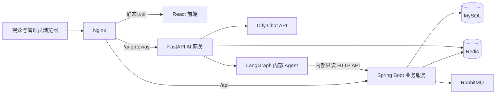

# 影院售票与 AI Agent 系统

一个由 React 前端、Java 票务后端和 Python AI 服务组成的全栈影院售票项目。项目实现影片与影院管理、排期、选座锁座、订单与模拟支付、退票规则、影票验票、影评社区，以及结合 Dify、LangChain 和 LangGraph 的影院问答助手。

项目以 Java 服务处理需要稳定权限校验和事务保护的票务业务，以独立 AI 网关和 Agent 处理聊天、知识问答和只读业务查询。当前支付和退款是系统内的流程演示，没有连接真实支付渠道。

## 功能概览

### 观众端

- 浏览影片、影院、影厅和可售场次，查看未来两周排期及影片评分。
- 选择场次和座位，锁座后创建订单；支持模拟支付、订单查询、主动取消、超时取消和按规则退票。
- 查看本人电影票和座位图；管理员可验票。
- 符合观影资格后可发布影片评分和影评，也可回复、点赞或举报内容。
- 使用独立的智能 Agent 窗口查询影片、场次、座位和本人订单，使用旁边的 Dify 悬浮球咨询常见问题；两者不共享聊天数据。

### 管理端

- 管理影片、海报、上架周期、场次排期、影院、影厅与座位。
- 管理退票政策，审核影评及回复，处理举报和 AI 回答反馈。
- 查询订单并执行验票。

## 系统架构



- **React + TypeScript：** 观众购票、管理后台、影院助手和前后端请求处理。
- **Spring Boot + MyBatis/JDBC：** 登录鉴权、影片与排期管理、订单状态、票务规则、影评和管理 API。
- **MySQL：** 保存账户、影片、场次、订单、支付记录、票项、影评等业务数据，是订单状态和占座判断的持久化依据。
- **Redis：** 保存登录会话、目录缓存、短期座位锁、AI 会话、限流额度和流式生成锁。
- **RabbitMQ：** 通过延迟消息异步触发未支付订单取消；定时对账任务补偿过期订单。
- **FastAPI AI 网关：** 维护聊天会话，调用 Dify 或内部 Agent，执行限流和 SSE 流式转发。
- **LangChain + LangGraph Agent：** 校验问题与参数，缺少信息时追问；通过 ReAct 循环选择白名单内的只读工具，根据真实结果继续查询或生成答复。普通聊天与网站流式聊天共用状态图，每轮默认最多尝试 4 次工具调用；知识检索包含本地 Markdown 关键词检索和 Java 数据库知识查询。
- **Docker Compose + Nginx：** 编排数据库、中间件和应用服务，并统一提供前端、业务 API 与 AI 网关入口。

## 核心业务流程

1. 管理员设置影片售票周期、影院影厅和放映场次。服务端结合影片售票窗口、场次时间及影院/影厅状态计算场次是否可订。
2. 观众选择场次后读取影厅座位图。Redis Lua 脚本原子检查并锁定所选座位，锁定时间为 5 分钟；每笔订单最多选择 6 个座位。
3. 锁座成功后创建 5 分钟有效的待支付订单。请求号用于下单幂等，支付流水号用于支付幂等；模拟支付成功后，订单完成出票。
4. 观众可主动取消未支付订单。订单超时后 RabbitMQ 延迟消息触发取消，消费者重新确认订单仍未支付后才释放座位；定时任务负责补偿。
5. 已出票订单依据数据库当前启用的退票规则校验资格。用户观影结束或完成验票后，可提交影评；审核通过且符合观影资格的评价计入公开评分。
6. Dify 与智能 Agent 使用独立入口、网关路由和 Redis 会话。Agent 查询时，Java 签发绑定登录用户和 Agent 会话的短期凭证；网关校验凭证后调用内部 Agent，Agent 只能使用 Java 提供的只读业务接口。Dify 不接收 Agent 的历史或查询结果。

## 关键设计取舍

- **MySQL 保存最终订单事实，Redis 保存短期状态。** 座位锁适合使用 Redis 快速控制并自动过期，但订单状态和最终占座依据保存在 MySQL，避免把短期锁误当作持久业务记录。
- **Lua 保证批量锁座原子性。** 多个座位的可用性检查和加锁在一次 Redis 脚本中完成，避免并发请求同时抢到同一座位或出现部分锁定。
- **幂等、事务和状态校验共同保护订单。** 创建订单使用请求号幂等，支付使用支付流水号幂等，并结合数据库事务和行锁处理竞争，降低重复订单、重复支付和超卖风险。
- **消息队列和对账任务共同处理超时。** 延迟消息把订单清理从同步请求中移出；定时对账为消息处理失败提供补偿路径。
- **AI 与交易业务分层。** Agent 不直连数据库、不生成任意 SQL，也不拥有支付或退款工具。身份、订单归属、事务和状态流转由 Java 服务校验，模型只负责理解问题和组织查询结果。
- **普通问答与实时查询独立。** Dify 悬浮球处理通用问答，内部 Agent 窗口查询本人订单等实时数据；各自保存历史、停止生成和提交反馈。网关独立承载会话和长连接，减少 Java 服务对 AI 流式输出的耦合。

## 技术栈

- **前端：** React 18、TypeScript、Vite
- **Java 后端：** Java 21、Spring Boot 3.4、MyBatis、JdbcTemplate、MySQL 8、Redis、RabbitMQ
- **AI 服务：** Python 3.12、FastAPI、LangChain、LangGraph、Dify Chat API、SSE
- **部署与运维：** Docker、Docker Compose、Nginx、Spring Boot Actuator、Prometheus 指标

## 项目结构

```text
.
├── cinema-ticketing-frontend/       # React 前端
├── cinema-ticketing-backend/        # Spring Boot、AI 服务、网关和 Compose 配置
│   ├── src/                          # Java 业务服务与数据库结构
│   ├── cinema-ai/                    # LangChain / LangGraph 内部 Agent
│   ├── cinema-ai-gateway/            # Dify 与内部 Agent 网关
│   ├── nginx/                        # 反向代理配置
│   └── docker-compose.yml            # 本地中间件及完整应用编排
├── docs/                             # 业务流程、影评和 AI 接入文档
├── deliverables/                     # RAG 知识库交付文件
└── 图片/                             # 影片海报存储目录
```

## 本地开发

### 环境要求

- JDK 21、Maven
- Node.js 22 及 npm
- Docker Desktop / Docker Compose
- 可选：Python 3.12；调用 Dify 和 Qwen 云端模型需要分别配置对应 API Key

### 启动基础设施

在 PowerShell 中：

```powershell
cd cinema-ticketing-backend
docker compose up -d mysql redis rabbitmq
```

首次创建 MySQL 数据卷时会初始化 `schema.sql` 和演示数据。已有数据卷不会自动重放初始化脚本。

### 启动 Java 服务

在 `cinema-ticketing-backend` 目录运行：

```powershell
mvn spring-boot:run
```

Windows 本地也可以使用 `powershell -File .\\start-local.ps1`。健康检查地址为 `http://localhost:8080/api/health`，Knife4j 接口文档地址为 `http://localhost:8080/doc.html`。

### 启动前端

另开终端：

```powershell
cd cinema-ticketing-frontend
npm ci
npm run dev
```

Vite 默认运行在 `http://localhost:5173`，并将 `/api` 转发到 Java 服务、将 `/ai-gateway` 转发到本地 AI 网关。

### 启动 AI 服务

按 [AI 助手启动与配置说明](docs/dify-agent-setup.md) 创建 Python 虚拟环境、安装依赖并配置模型密钥。Java、Agent 和网关之间的 `AI_INTERNAL_TOKEN` 必须一致。未配置 Qwen 密钥时，内部 Agent 可使用确定性意图路由和基于真实查询结果的模板回复；Dify 云端问答需要有效的 Dify API Key。

### Docker 启动完整应用

先在 `cinema-ticketing-backend` 目录构建 Java JAR，再启动 Compose 应用：

```powershell
mvn clean package -DskipTests
docker compose --profile app up -d --build
```

前端入口为 `http://localhost/`，API 健康检查为 `http://localhost/api/health`。完整部署可选配置 `QWEN_API_KEY`、`DIFY_API_KEY` 和 `AI_INTERNAL_TOKEN` 环境变量；也可按部署说明提供本地密钥文件。密钥不得提交到版本库。Compose 中的本地演示凭据仅供开发使用。

## 验证

```powershell
# 前端类型检查与生产构建
cd cinema-ticketing-frontend
npm run build

# 前端测试
npm test

# Java 测试
cd ..\cinema-ticketing-backend
mvn test
```

并发一致性测试命令为 `mvn -Dtest=OrderConcurrencyConsistencyTest test`，需要可连接的 MySQL；测试会启动真实嵌入式 Redis，并直接调用订单 Service。当前记录的测试验证重复锁定、超卖、重复下单和重复支付等数据一致性，不代表 HTTP 层或整套 RabbitMQ 链路的吞吐量测试，详见[并发一致性实测报告](cinema-ticketing-backend/压测报告.md)。

## 文档导航

- [当前业务流程与实现边界](docs/business-logic.md)
- [AI 网关、Dify 与内部 Agent 配置](docs/dify-agent-setup.md)
- [Agent ReAct 工具循环与流程图](docs/agent-react-flow.md)
- [Dify 与 Agent 聊天隔离及更新说明](docs/ai-chat-isolation.md)
- [内部 Agent 长期记忆接入方案：MySQL + Chroma](docs/agent-long-term-memory-chroma.md)
- [Dify 与内部 Agent 方案说明](docs/dify-agent-options.md)
- [影评、审核与验票说明](docs/movie-reviews.md)
- [后端 API、运行和功能说明](cinema-ticketing-backend/README.md)

## 当前边界

- 支付使用演示流水号；退款只记录影院系统内的业务结果，不触发真实资金结算。
- Agent 只执行只读查询；下单、支付和退款由业务页面及 Java 服务处理。
- 本地知识检索采用关键词重叠排序，不是向量数据库检索；退票资格以 Java 实时业务结果为准。
- 并发测试侧重数据一致性，未覆盖 HTTP、Nginx 和真实 RabbitMQ 消费链路的完整压力测试。
