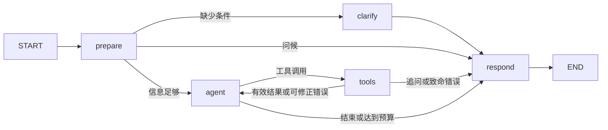

# 影院售票系统

一个包含观众购票、影院管理和 AI 助手的全栈项目。观众可以浏览影片与场次、选座锁座、创建订单、模拟支付、查看影票、取消或申请退票，并在符合购票条件后评价影片；管理员可以维护影片、影院、影厅和排期，并处理影评与 AI 回答反馈。

项目由 React 前端、Spring Boot 业务服务、FastAPI AI 服务和独立 AI 网关组成。主要技术包括 Java 21、Spring Boot、MyBatis、MySQL、Redis、RabbitMQ、LangChain、LangGraph、Dify、Docker Compose 和 Nginx。当前支付与退款是系统内的业务流程演示，没有连接真实支付渠道。

## 核心业务流程

1. 管理员维护影片、售票周期、影院影厅及放映场次；系统根据售票周期、场次时间和影院/影厅状态判断场次是否可订。
2. 观众选择场次和座位。服务端使用 Redis Lua 原子锁定座位，锁定有效期为 5 分钟；锁座后创建待支付订单。
3. 订单通过模拟支付后完成出票。观众可以查看本人订单、影票与座位；未支付订单可以主动取消，也会在超时后自动取消并释放座位。
4. 已出票订单按当前退票政策校验退票资格。观众完成观影或验票后，可以提交影片评价；评价审核通过后进入公开评分统计。
5. AI 助手处理影片、场次和票务规则咨询。需要本人订单等实时数据时，用户可以主动转接内部 Agent 查询。

## 架构与关键设计

- **业务服务负责最终状态：** Java 服务承担鉴权、参数校验、订单事务和状态流转；MySQL 保存订单、支付、票项及退款等业务事实。AI Agent 通过受控的 Java 内部接口只读查询，不直接访问数据库，也不执行支付、退票等写操作。
- **Redis 处理短期和高频状态：** Redis 用于座位短锁、目录缓存、登录会话、AI 会话与限流。Lua 脚本将多座位检查和加锁合并为原子操作；锁的 TTL 可在用户中断流程后自动释放。订单状态仍以 MySQL 为准。
- **并发写入使用幂等与状态校验：** 创建订单使用请求号幂等，支付使用支付流水号幂等，并结合数据库事务和行锁处理竞争，降低重复订单、重复支付和超卖风险。
- **异步处理订单超时：** RabbitMQ 延迟消息触发超时取消；消费者再次确认订单仍为未支付后才取消并释放锁。定时对账任务补偿未成功处理的过期订单。
- **AI 服务与票务业务分层：** Dify 负责常见问答，独立网关处理会话、限流和 SSE 流式转发；用户主动转接后，LangGraph Agent 通过 ReAct 循环组合白名单内的只读业务工具。知识库用于解释购票与退票规则，实时订单资格以 Java 返回的业务结果为准。

该拆分让核心交易规则集中在 Java 服务中，同时允许 AI 问答独立迭代；Redis 与消息队列分别承担短期并发控制和异步超时处理，避免把所有状态变化都放进单次同步请求。

## 运行环境

运行环境：JDK 21、MySQL 8.0.44。项目显式锁定 MySQL Connector/J 8.0.33；该驱动适配 MySQL 8.0.x，避免本地开发环境因 Maven 依赖管理变化而产生版本差异。

## 本地启动

1. 启动基础设施：`docker compose up -d mysql redis rabbitmq`（首次启动会自动执行 `schema.sql`）
2. 构建并启动服务：`mvn spring-boot:run`
3. 健康检查：`GET http://localhost:8080/api/health`
4. Knife4j 中文接口文档：`http://localhost:8080/doc.html`

Windows 本地开发可在停止旧服务后运行 `powershell -File .\start-local.ps1`。脚本每次先重新打包，再以 `local` 配置启动，确保新增控制器已加载；图片目录固定为项目根目录的 `图片`。端口可用 `-Port 8081` 覆盖。

如果上传图片出现“接口不存在: /api/movies/{id}/poster”，请检查运行中的后端是否为最新构建。仅编译或刷新前端不会让已经运行的 Java 进程加载新控制器。最新的 `/api/health` 返回 `features.moviePosters: true`，影片编辑页会在保存图片前检查该能力，旧后端将被拦截，避免先保存影片信息再报图片错误。

## Docker 启动

1. 在 `cinema-ticketing-backend` 目录构建 JAR：`mvn clean package -DskipTests`
2. 启动完整应用：`docker compose --profile app up -d --build`
3. 前端入口为 `http://localhost/`，健康检查为 `http://localhost/api/health`

首次创建 MySQL 数据卷时，Compose 会依次执行 `schema.sql` 和演示数据脚本 `seed-local-data.sql`。已有数据卷不会重放初始化脚本；需要演示数据时可手动执行该 SQL 文件。场次会按北京时间当天补充 2～3 天后的演示排期，同一天重复执行不重复插入，已有重叠排期则跳过；旧场次及历史订单保持原样。

`GET /api/screenings` 和 AI 场次查询仅返回尚未开场、影片可售且影院/影厅启用的场次，场次列表不缓存。历史订单由订单接口直接返回影片、影院、影厅和开场时间，不依赖可售场次列表。

影片管理支持上架开始/截止时间（北京时间）和多个放映场次；各场次可选影院/影厅、开场/结束时间、票价及状态。周期与场次随影片资料在同一事务中保存，失败时整体回滚。完整放映时间须在周期内，影厅排期不能重叠；已有订单的场次只能保留。旧影片两项周期均为空时保持不限时行为。影片列表的 `sales_status` 区分可订购、待排期、未上架和已截止。

已有数据库升级前先执行 `migrations/20260926-movie-sale-window.sql`（可重复执行，只添加缺失列）；新数据库已在 `schema.sql` 中包含对应字段。上架周期开始时可售，截止时停止售票；无需定时任务修改影片状态。

新建或调整排期时，场次占用结束时间固定为开场时间 + 影片片长 + 20 分钟周转时间，后端按包含周转时间的区间检查影厅冲突。已有订单场次保留原值；周期表计算旧场次的周转占用时也预留至少 20 分钟。影片编辑窗口提供 7/14/28 天的影厅排期周期表，按时间排序并叠加未保存场次，可点击空档添加场次。

订单列表返回当前退票政策对应的 `refund_deadline`、`can_refund`、`refund_reason` 和服务器时间。前端按服务器时间校正倒计时，到截止时刻禁用并灰显退票按钮；后端退票校验仍为最终依据。观众片单及管理统计区分正在上映和待排期影片。

`GET /api/orders/{orderNo}/seat-map` 校验订单归属后返回真实影厅座位布局和本订单座位标记，不受场次停售影响，也不暴露其他订单。订单列表的“查看电影票 / 查看座位”入口展示银幕方向、排号、座位号和订单状态；失效订单明确标注仅供查看记录。影片编辑分为资料、上架、排期三个页签，排期列表按需展开，周期表独立切换，切换时保留未保存内容。

首页轮播当前可售的上映影片，支持切换、暂停及减少动态效果；两周日程通过 `GET /api/screenings/schedule?from=YYYY-MM-DD&to=YYYY-MM-DD` 展示今天起 14 个自然日的已排场次（截止日期不包含），包含未到上架时间的影片；返回同一场次关联的影片/影厅/影院资料及 `can_book`，未开放购票的场次显示开放时间并禁用选座。日程按北京时间的开场日期归类，管理端周期表另外标明跨日占用；影片的 `future_screening_count` 用于区分已排期待上架与待排期，支持日期/影院筛选与选座入口，定期刷新真实排期。影片详情提供评论和 1～5 星评分，登录用户每部影片一条评价，可修改或删除本人评价，分页读取；片单展示真实平均分与评价数量，无评价时显示“暂无评分”。已有数据库升级先执行 `migrations/20260926-movie-reviews.sql` 创建评价表，新库 `schema.sql` 已包含该表。

基础设施账号仅用于本地开发，生产环境必须通过环境变量替换。

## 第二阶段接口

通用资源接口支持 `users`、`movies`、`cinemas`、`halls`、`seats`、`screenings`：

- `GET /api/{resource}`：列表查询
- `GET /api/{resource}/{id}`：详情查询
- `POST /api/{resource}`：管理端新增
- `PUT /api/{resource}/{id}`：管理端全量更新
- `DELETE /api/{resource}/{id}`：管理端删除
- `GET /api/orders?userId={userId}`：订单列表
- `GET /api/orders/{orderNo}`：订单详情

写接口已要求 `X-Auth-Token`，只有登录后的 `ADMIN` 用户可以操作；注册接口为 `POST /api/auth/register`，登录接口为 `POST /api/auth/login`，退出接口为 `POST /api/auth/logout`。

用户列表和用户详情同样要求管理员权限。影片名称、片长、上映状态和日期会在服务端校验；不存在的资源返回 404，关联数据阻止删除时返回 409，不会误报保存成功或服务器故障。

影院管理现由独立的 `CinemaController`、`CinemaService` 和 MyBatis `CinemaMapper` 负责，沿用 `GET/POST /api/cinemas`、`GET/PUT/DELETE /api/cinemas/{id}`。新增和修改校验名称、地址及 `ACTIVE`/`INACTIVE` 状态；查询不存在的影院返回 404，已有影厅的影院不能直接删除（返回 409）。管理员登录后可在前端“影院管理”页面操作。

影片图片保存在项目根目录的 `图片` 文件夹，文件名按影片 ID 生成，不需要修改已有数据库表。管理员在影片管理页新增或编辑影片时可以上传、替换和移除图片；观众片单优先显示已上传的图片。接口为 `GET /api/movies/{id}/poster`、`POST /api/movies/{id}/poster`（`multipart/form-data`，字段名 `file`）和 `DELETE /api/movies/{id}/poster`。写操作需要管理员 `X-Auth-Token`，支持 JPG、PNG、WebP，单张最大 5 MB。删除影片后会清理对应图片。应用在 `cinema-ticketing-backend` 目录启动时默认写入 `../图片`；也可用 `MOVIE_IMAGE_DIRECTORY` 指定绝对目录。Docker Compose 已将项目根目录的 `图片` 挂载进后端容器，重建容器不会丢失上传的图片。

用户列表和详情只返回脱敏字段，绝不返回 `password_hash`。密码使用 BCrypt 哈希保存。登录 token 使用 Redis TTL（2 小时）保存，支持多实例共享；单元测试未启用 Redis 时才使用进程内存回退。

持久化取舍：用户账户与鉴权查询已使用 MyBatis Mapper；通用后台资源 CRUD 暂时保留 JdbcTemplate 动态实现，以减少重复 Mapper 样板代码。后续若进入多条件查询和复杂事务，将按资源拆分为独立 Entity、Mapper、Service 层。

## 第三阶段购票闭环接口

- `GET /api/screenings/{screeningId}/seats`：查询场次座位和实时占用状态
- `POST /api/orders/lock-seats`：使用 Redis Lua 脚本原子锁座，锁定时间为 5 分钟
- `POST /api/orders`：每单最多 6 个座位，创建 5 分钟有效的待支付订单，`requestId` 用于请求幂等
- `POST /api/orders/{orderNo}/pay`：模拟支付并完成出票，订单按 `UNPAID -> PAID -> ISSUED` 流转
- `POST /api/orders/{orderNo}/cancel`：用户主动取消待支付订单并释放座位
- `GET /api/orders/{orderNo}`：查询当前登录用户的订单详情
- `GET /api/orders`：查询当前用户的订单列表
- 支付必须提交支付流水号 `paymentNo`；重复提交同一订单和流水号具备幂等性
- `POST /api/orders/{orderNo}/refund`：读取 `refund_policy` 数据库策略，校验退票截止时间后执行退票，状态变为 `REFUNDED`

Redis 负责短期座位锁，MySQL 的订单状态和明细负责最终占座判断；订单过期后由 RabbitMQ 与定时对账任务取消。

## 第四阶段消息与并发

- 订单创建事务提交后发送 `order.cancel.delay` 延迟消息
- 延迟队列过期后通过死信交换机进入 `order.cancel` 消费队列
- 取消消费者使用手动 ACK，最多重试 3 次，最终失败消息进入 `order.cancel.failed`
- `message_consume_record` 保证消费者幂等；订单取消使用 `UNPAID` 条件更新避免重复状态变更
- 订单保存 Redis 锁持有者，超时取消只释放对应用户的座位锁
- RabbitMQ 地址支持 `SPRING_RABBITMQ_HOST`、`SPRING_RABBITMQ_PORT`、`SPRING_RABBITMQ_USERNAME` 和 `SPRING_RABBITMQ_PASSWORD` 配置

## 第五阶段部署优化

- 影片、影院、影厅和场次等目录查询使用 Redis 缓存，写操作自动清理缓存，缓存 TTL 为 5 分钟；实时座位查询不使用缓存
- 所有 `/api/*` 请求默认按客户端 IP 限制为每分钟 120 次，可通过 `RATE_LIMIT_REQUESTS_PER_MINUTE` 调整
- `/actuator/health`、`/actuator/metrics` 和 `/actuator/prometheus` 提供健康检查与监控指标
- 请求自动生成 `X-Trace-Id`，日志记录请求路径、状态码和耗时
- Docker Compose 已配置 MySQL、Redis、RabbitMQ 健康检查和服务启动依赖；Nginx 负责反向代理、转发真实客户端 IP 和网关日志

## 第六阶段 AI 助手

新增独立 `cinema-ai` 服务，端口为 `8000`，通过 HTTP 调用 Java 内部业务接口，不直接访问数据库。

- `POST /api/ai/chat`：Java 鉴权后转发到 AI 服务
- `POST /api/ai/stream`：SSE 形式返回 AI 助手结果
- `POST /ai/chat`：AI 服务结构化问答
- `POST /ai/stream`：AI 服务流式问答
- 内置 LangChain Tools：影片查询、场次查询、订单查询、退票规则、电影推荐、退票资格
- 内置 RAG 知识库：购票须知、退票规则、影院 FAQ，回答携带来源和规则版本
- Java 侧提供 `/internal/knowledge/search`，内容持久化在 `knowledge_document` 表；AI 同时合并数据库知识和本地 Markdown 知识检索结果
- AI 只读调用 Java 内部接口，支付、退票等写操作仍由 Java 鉴权、事务和状态机负责

`/api/ai/stream` 使用 Spring MVC `StreamingResponseBody` 直接透传 AI 服务的 SSE 响应，不再等待完整响应体后一次性返回。

AI 服务支持 `OPENAI_API_KEY` 和 `OPENAI_MODEL`；未配置模型密钥时使用确定性意图路由和本地 RAG，仍可完成基础演示。

## 第七阶段 LangGraph Agent

AI 服务已使用 LangGraph 状态图组织完整流程：

`/ai/chat` 与网站使用的 `/ai/live` 共用这张图。`prepare` 提取并校验查询条件；缺少必要条件时先追问。`agent` 通过模型原生工具调用选择下一步，`tools` 校验参数、执行 MCP/Java/RAG 查询并将结果作为 `ToolMessage` 交回模型。模型可继续查询、调用 `ask_user` 或结束；`respond` 根据已验证结果组织答复，流式接口只推送状态和最终答复，不推送内部规划。

每轮默认最多尝试 4 次工具调用，`AGENT_MAX_TOOL_CALLS` 可配置为 1～8；重复和不合法调用也占用预算。身份由服务器注入，场次编号来自用户明确提供或本轮真实查询结果。未配置模型或工具选择失败时降级到确定性查询；降级路径不具备模型动态规划能力。现有长期偏好记忆及显式保存确认保留。详见[流程图与实现说明](../docs/agent-react-flow.md)。

数据库、服务端口和凭据均支持通过环境变量覆盖：`DB_URL`、`DB_USERNAME`、`DB_PASSWORD`、`SERVER_PORT`、`AI_SERVICE_URL`、`AI_INTERNAL_TOKEN`。
