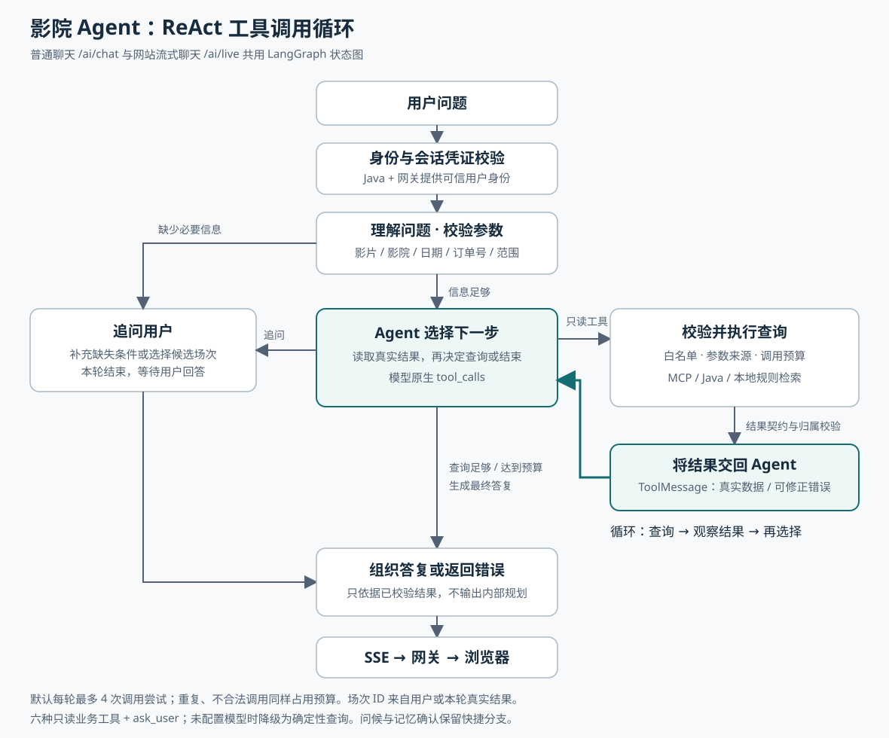
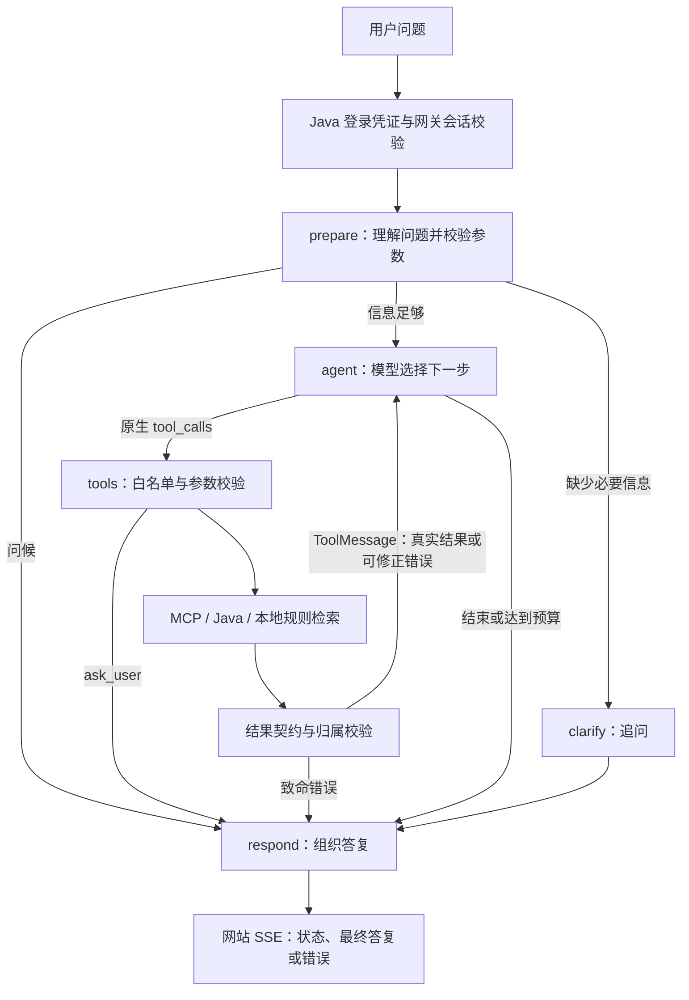

# Agent ReAct 工具调用循环

当前实现将普通聊天 `/ai/chat` 与网站流式聊天 `/ai/live` 接入同一张 LangGraph 状态图。模型通过原生 `tool_calls` 选择工具，每次查询结果转换为 `ToolMessage` 交回模型，模型再决定继续查询、追问或结束。这是 ReAct 工具调用循环，区别于前端 React 框架。

[直接打开 SVG 流程图](agent-react-flow.svg)。SVG 可用 Chrome 打开，不需要运行 TypeScript 或安装图表插件。

## 状态图与网站链路

Java 与网关在进入内部 Agent 前校验登录和会话凭证；内部 Agent 接口仍受内部服务令牌保护。工具使用服务器传入的用户身份，模型不能传入或更换用户 ID。

## 当前可实现的查询

- 影片资料、上映中影片、实际已排期影片。
- 场次时间、影院、票价，以及实际排期与可订购范围的区别。
- 查询返回真实场次 ID 后继续查座位；多个候选未明确选择时可追问。
- 查询本人订单状态与当前退票资格，再查询退票规则和来源。
- 按用户明确偏好及已确认的长期偏好查询电影推荐。
- 必要信息缺失时调用 `ask_user`，结束本轮并等待用户补充。

例如：“《测试电影》今天的场次和各场空座”，模型可以执行 `search_screenings → query_seats(返回的场次 ID) → query_seats(另一真实 ID) → 最终答复`。能查多少场受预算限制；座位是查询时快照，购票仍需进入选座页面。

## 循环边界与降级

- `AGENT_MAX_TOOL_CALLS` 默认 `4`，范围为 `1～8`。不合法、重复调用和 `ask_user` 都占用尝试预算；相同参数不会重复请求业务服务。
- 保留已校验的日期、查询范围、影片/影院关键词等条件。模型不能把“已排期”改成“上映中”，也不能自行换日期。
- 订单号只能来自用户消息；座位查询的场次 ID 只能来自用户明确提供或本轮通过校验的查询结果，不能使用助手历史里猜测的 ID。
- 仅开放六种只读业务工具和追问控制工具。锁座、下单、支付、取消订单、退款没有开放给模型。
- 模型工具选择单次最多等待 20 秒；接口整轮上限 80 秒。内部规划不流向浏览器；网站显示查询状态与最终回复。
- 没有有效业务结果时返回错误，不允许模型直接编造业务状态。结果契约错误或订单归属错误会停止循环。
- 部分查询失败或触及预算时，答复说明已完成的范围。未配置模型、或工具选择失败时降级为确定性查询与事实模板；该降级路径不具备动态多步规划能力。
- 单次影片/场次列表仍使用确定性格式展示，以保留已有查询范围、日期及空结果语义；多步汇总、订单和规则等答复可由模型流式生成。
- 长期记忆只提供偏好，不作为实时票务事实。保存记忆仍需要用户在界面确认；停止流式回复会取消正在执行的图任务。

## 实现位置

- `cinema-ticketing-backend/cinema-ai/app/react_agent.py`：共享状态图、模型决策、工具结果反馈、预算和答复。
- `cinema-ticketing-backend/cinema-ai/app/react_tools.py`：模型工具定义、参数来源检查与查询结果校验。
- `cinema-ticketing-backend/cinema-ai/app/main.py`：聊天入口、已有 MCP/Java/记忆服务注入与 SSE 转发。
- `cinema-ticketing-backend/cinema-ai-gateway/app/main.py`：网关保留实际工具调用记录并转发安全错误。

## 验证与生效

已完成的本地验证：16 项 ReAct 测试、16 项意图与查询语义测试、16 项 MCP 测试通过，变更 Python 文件的 Ruff 检查通过。ReAct 测试使用脚本模型与模拟业务结果，覆盖多步查询、身份隔离、伪造 ID、未知写工具、重复调用、预算、错误结果、取消查询和记忆确认；没有调用真实 Qwen 服务。

代码生效需要重启内部 `cinema-ai` 和 `cinema-ai-gateway` 服务。Java 接口、前端协议与依赖版本无需因本次修改而调整。模型密钥继续使用现有服务端配置；服务启动不会自动发起生成请求。实际模型能否稳定选择正确工具仍需在部署后结合真实问题观察，本地模拟测试不代表真实模型效果评估。
