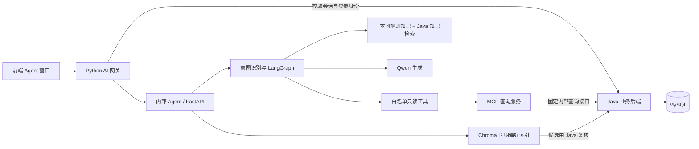

# 内部 Agent Python 代码全量说明

本文按当前仓库中的运行代码说明内部 Agent 的 Python 实现，重点解释各文件的职责、主要函数、数据流和安全边界。代码目录是 `cinema-ticketing-backend/cinema-ai/`；根目录的 `内部agent/源文件/` 是较早的备份快照，不是启动时导入的代码。

本说明覆盖 `cinema-ai` 下的应用源码、离线评估、脚本和测试。`cinema-ai-gateway/` 也是 Python 项目，但它是与 Agent 分开的接入服务，本文末尾单独说明。按模块和关键函数解释，比把每个赋值、括号和导入逐行换成中文更适合实际阅读；涉及的 Python 文件均在下面逐一列出。

## 1. 先看系统边界

内部 Agent 是一个自然语言查询服务。它负责理解问题、规划只读查询、调用工具并组织回答；它不是 Java 票务服务，也不拥有票务数据库。电影、场次、座位、订单和退票资格等当前业务事实仍由 Java 后端提供。

Agent 不直连 MySQL，不生成任意 SQL，也没有锁座、下单、支付、取消订单或退款工具。用户身份由网关和 Java 校验后注入服务端调用链；模型不能靠参数切换 `user_id`。座位、订单等查询结果仍以 Java 为准。

## 2. 一次实时提问怎样走完

1. 浏览器将聊天请求发给 AI 网关。网关检查标签页、会话和当前登录身份；需要实时查询时，Java 校验转接凭证并返回可信用户身份。
2. 网关将问题、会话标识、受限历史和可信用户 ID 发给内部 Agent 的 `/ai/live`。Agent 的 FastAPI 入口还要求内部服务令牌。
3. `main.py` 创建本轮 Agent 状态。意图模块归一化说法、识别时间和实体；规则确定查询范围，结构化模型理解可补充意图解析。
4. `task_progress.py` 把用户明确要求拆成待完成事项。缺少场次编号等关键信息时，Agent 追问；不会猜测数据库 ID。
5. LangGraph 的 ReAct 循环让模型从白名单工具中选择下一步。`react_tools.py` 再检查参数的类型、来源、范围和重复调用。
6. 影片、场次、座位、本人订单查询经 `mcp_client.py` 调用独立 MCP 服务。MCP 服务用固定 Java 内部 API 取数，检查可信用户身份和结果结构。规则知识与推荐通过 `JavaApiClient` 或本地检索调用。
7. 真实结果回到 Agent 状态图。结果契约和订单归属再次校验；模型可继续查、追问或生成答复。影片列表、场次列表等需要稳定格式的回答可由事实模板生成。
8. `/ai/live` 将状态和最终回答作为 SSE 事件返回网关，再由网关转给前端。追踪模块记录脱敏后的节点、模型、工具耗时和错误。

典型组合问题如“《某片》明天每一场还有多少空座”：先搜符合条件的场次，再仅对真实返回的场次 ID 查询座位。用户只问“这部片有空座吗”而命中多个场次时，Agent 会要求用户选场次或按明确表达的首场/前两场规则收窄。

## 3. 运行时应用代码：`cinema-ai/app/`

### 服务入口和图编排

- [`main.py`](../cinema-ticketing-backend/cinema-ai/app/main.py)：FastAPI 主入口。定义 `/health`、兼容用的 `/ai/chat` 和 `/ai/stream`，以及网关当前使用的 `/ai/live`。`ChatRequest`、`LiveChatRequest`、`HistoryMessage` 和 `ChatResponse` 限制输入长度、历史条数与响应形状。`verify_internal_token()` 校验内部调用凭证。`Assistant` 在进程启动时创建 Java 客户端、MCP 客户端、Qwen 模型、规则检索器、重排器、记忆访问器和 `CinemaReAct` 图。`_call_tool()` 把影片/场次/座位/订单查询送往 MCP，其余已登记工具走本地工具表。`chat()`/`_chat()` 运行共享图并维护兼容聊天接口的短历史；`live()`/`_live()` 把图的自定义事件转成网关使用的 SSE 事件，并处理记忆建议和记忆查看请求。`lifespan()` 关闭 HTTP 连接池并尽量上传追踪队列。
- [`react_agent.py`](../cinema-ticketing-backend/cinema-ai/app/react_agent.py)：Agent 状态图和 ReAct 控制循环。`AgentState` 保存身份、会话、问题、意图、提取实体、任务、观察结果、工具调用预算、回答和错误等本轮状态；`initial_state()` 建立初始值；`emit_context()` 推送可展示的查询状态；`response_data()` 从已验证观察中组装业务结果。`CinemaReAct` 构造 `prepare → clarify / agent → tools → agent / respond` 的图：`prepare()` 做意图识别、召回偏好并生成任务；`route_prepared()` 决定追问还是查询；`clarify()` 输出缺少的信息；`agent()` 让模型挑选下一工具或结束；`tools()` 执行参数与结果校验、去重和预算控制；`respond()` 决定事实模板、模型答复、部分结果说明或错误。`fallback_call()` 在模型不可用或无法完成规划时执行受限补查；`has_primary_evidence()`、`completion_note()` 防止没有业务证据却声称查询成功。默认每轮最多尝试 4 次工具调用，配置范围为 1～8；无效/重复调用另有限制。模型不能绕开这些程序校验。
- [`intent.py`](../cinema-ticketing-backend/cinema-ai/app/intent.py)：中文问题理解与约束提取。`QuestionPlan` 是 Pydantic 结构化结果，只包含受限意图和查询字段，没有 SQL 或身份字段。`normalize_question()` 统一空格和领域同义说法；`explicit_date()` 将“明天”“下周三”等转为北京时间日期；`listing_kind()` 区分影片资料、上映状态、已排期场次和可购票场次；`rule_plan()` 用确定性规则识别问候、退票/订单、座位、政策、推荐、影片名、订单号、场次编号、影院和日期；`understand()` 在 Qwen 可用时用 JSON 结构化输出补充抽取，再以规则结果强制覆盖敏感范围并拒绝无来源关键词。模型结果不可信，必须经过模式校验与规则修正。模型不可用时仍可由规则给出有限计划。
- [`task_progress.py`](../cinema-ticketing-backend/cinema-ai/app/task_progress.py)：把用户要的“结果”变成完成清单，而不是只看模型选了什么意图。`build_tasks()` 会生成影片、场次、座位、订单、规则或推荐任务；`screening_rows()` 只从本轮已验证的查询结果中收集场次；`progress()` 将观察结果与待办逐项匹配，处理座位查询对场次查询的依赖，并在多个候选场次时要求澄清；`is_complete()` 判断所有任务是否有结果或权威空结果；`next_call()` 为模型提前结束的情形返回一个有界补查动作。

### 工具定义、参数与业务结果

- [`react_tools.py`](../cinema-ticketing-backend/cinema-ai/app/react_tools.py)：模型可见的工具参数结构和安全校验。各参数模型限制 ID、关键词长度、日期、范围及必需字段。`validate_arguments()` 检查工具是否在白名单、实体是否来自用户问题/已确认偏好/本轮结果、订单号是否由用户提供、场次 ID 是否来自用户明确输入或已验证场次结果，同时拒绝身份字段和越权范围。`validate_result()` 校验不同工具的返回契约；订单结果若返回不同订单号或不同用户，立即按安全错误停止。`observation_text()` 将结果序列化给模型，并在超过上限时显式标记截断。
- [`query_answers.py`](../cinema-ticketing-backend/cinema-ai/app/query_answers.py)：机器结果的形状与业务语义校验，以及稳定的中文事实回答格式。影片的“上映中”与“存在实际场次”分开判断；场次的“已排期”与“当前可订购”也分开表达。`movie_details()` 提取影片字段；`movie_answer()` 和 `screening_answer()` 把已验证结果格式化为可读清单，并说明分页/数量截断；验证函数拒绝与查询条件不符的结果。
- [`java_client.py`](../cinema-ticketing-backend/cinema-ai/app/java_client.py)：共用的异步 HTTP 客户端，固定 Java 服务地址、内部令牌和超时；只提供 `get()`、`post()` 和关闭连接池方法，不拼接任意 SQL。
- [`mcp_client.py`](../cinema-ticketing-backend/cinema-ai/app/mcp_client.py)：Agent 到 MCP 服务的客户端。`QUERY_TOOLS` 限定电影、场次、座位和订单查询工具；每次工具调用都新建带 `X-Internal-Token` 和可信 `X-AI-User-ID` 的 HTTP/MCP 会话，身份不放进模型提供的工具参数。它解包结构化返回值，并将 MCP 错误转为统一业务异常。
- [`mcp_server.py`](../cinema-ticketing-backend/cinema-ai/app/mcp_server.py)：独立只读 MCP 服务，默认监听 8020，协议入口 `/mcp`。`InternalTokenMiddleware` 除健康检查外校验内部令牌；`create_app()` 注册固定工具：`search_movies`、`search_screenings`、`query_seats`、`query_order`。工具参数有严格类型/长度限制，并转为固定 Java 查询接口。订单工具从受信请求头读用户 ID，再要求 Java 同时按订单号和用户身份核验归属。`fetch()` 把成功或失败包成统一 MCP 结构。所有工具标为只读；Agent 不能要求 MCP 执行写入。
- [`failures.py`](../cinema-ticketing-backend/cinema-ai/app/failures.py)：跨模型、HTTP、MCP 的稳定错误分类。`CinemaQueryError` 携带项目错误码；`describe_failure()` 仅记录阶段、异常类别、HTTP 状态和追踪 ID，不记录密钥、订单正文或对话；`_failure_details()` 将鉴权、超时、限流、上游不可用、数据不存在等映射成固定用户提示。

### 规则知识检索和重排

- [`policy_retrieval.py`](../cinema-ticketing-backend/cinema-ai/app/policy_retrieval.py)：从 `cinema-ai/knowledge/` 读取 Markdown，将内容切块并保留来源元数据；`keyword_terms()` 与 `KeywordRetriever` 提供本地中文关键词基线；`policy_candidates()` 合并本地知识、Java 当前退票规则和 Java 知识检索结果，再去重并限制候选规模。它不是实时订单或票价数据源。
- [`reranker.py`](../cinema-ticketing-backend/cinema-ai/app/reranker.py)：把上述候选交给 DashScope `qwen3.7-text-rerank` 排序。`RerankSettings` 校验模型地址必须为允许的阿里云 HTTPS 端点，并限制输入/输出数量和超时；响应 Pydantic 模型校验排名索引与分数；`DashScopeReranker.rerank()` 将排序结果映射回原文档。服务失败、响应异常或超时会记录脱敏指标并回退到本地候选顺序，不阻断业务查询。
- [`model_config.py`](../cinema-ticketing-backend/cinema-ai/app/model_config.py)：配置 Qwen3.7 Flash 的模型名、兼容接口地址、超时、token 上限和 thinking 开关。`load_qwen_key()` 先读环境变量，再读本地密钥文件；不会记录密钥内容。`create_model()` 只构造客户端，不在启动时请求模型；没配密钥时返回 `None`，图会走有限规则/模板降级。

### 长期偏好记忆

- [`memory.py`](../cinema-ticketing-backend/cinema-ai/app/memory.py)：Agent 侧记忆读取与 Chroma 投影。`MemoryIndex` 惰性连接 Chroma，使用固定 BGE 中文 embedding 在 CPU 上向量化，支持 upsert 和删除；`UserMemory.recall()` 先由 Java 取得该用户有效记忆，再用 Chroma 找少量相似候选，随后必须由 Java 按可信 `user_id`、记忆 ID 和版本再次核验。向量服务不可用时回退到 Java 当前有效偏好；全部记忆服务不可用时返回空记忆，不影响票务查询。`memory_proposal()` 只识别用户明确说“记住……”的请求，给前端显示待确认提议，不自行写入记忆。
- [`memory_worker.py`](../cinema-ticketing-backend/cinema-ai/app/memory_worker.py)：长期记忆索引后台 worker。`run()` 循环向 Java 领取 outbox 任务；`process_job()` 检查任务版本是否仍是最新，按内容对 Chroma upsert/delete，成功或失败后带租约令牌向 Java ack。它不是 Agent 的 HTTP 请求进程。
- [`memory_runtime.py`](../cinema-ticketing-backend/cinema-ai/app/memory_runtime.py)：本机启动辅助入口。根据 `--service chroma` 启动持久化 Chroma，或根据 `--service memory` 运行索引 worker；从 Agent `.env` 载入配置并设置模型数据目录。
- [`provision_memory_model.py`](../cinema-ticketing-backend/cinema-ai/app/provision_memory_model.py)：一次性准备/下载固定版本的本地 BGE embedding 模型。日常查询使用已落盘模型，不在每条请求时下载。

这里有两套不同用途的“知识/向量”机制：票务规则 RAG 使用本地 Markdown、Java 知识接口和重排；长期记忆使用 Chroma 保存个人偏好的向量索引，MySQL/Java 才是记忆记录的权威来源。Chroma 不存订单事实，也不能替代数据库。

### 追踪和模块边界

- [`tracing.py`](../cinema-ticketing-backend/cinema-ai/app/tracing.py)：LangSmith 和本地追踪归档。`load_langsmith_key()` 读取服务端密钥；`summarize_payload()`、`_metadata()`、`_run_fields()` 将输入输出改写成允许上传的脱敏摘要；`MetadataOnlyClient` 在 SDK 创建/更新 span 时执行过滤；`TraceTurn` 接收节点、模型、工具、完成/失败/取消事件；`AgentTracing` 管理每轮 trace 的创建、状态、刷新和错误记录；`tool_span()` 为工具调用补充耗时。追踪按配置只在本地/预发环境开启，并写到根目录 `langsmith(tracing)/YYYY_MM_DD/`。默认不上传原始问题、历史、答案、订单或工具参数。
- [`__init__.py`](../cinema-ticketing-backend/cinema-ai/app/__init__.py)：标记 `app` 为 Python 包，没有额外业务行为。

## 4. 评估代码：`cinema-ai/evaluation/`

该目录是离线诊断和回归评估，不是用户请求时必经的生产链路。评估可用固定案例、快照和模拟模型，衡量意图抽取、工具选择、答案证据、重排及耗时；脚本运行可能访问 Java 或模型服务，需看各脚本参数和环境配置。

要特别区分：Agent 在线服务自身不直连 MySQL；但 `live_cases.py` 是开发评估工具，会通过本机 MySQL 命令读取一份开发数据清单，并通过 Java 固定接口冻结查询结果。`run.py` 可启动隔离的 Java/MCP 评估服务并调用真实 Qwen，`runtime_check.py` 会向已运行的 Agent 发送评估问题，`check_rerank.py` 会发起一次合成重排请求。这些是人工运行的诊断工具，不是每次聊天都会执行的代码。

| 文件 | 作用 |
|---|---|
| `evaluation/__init__.py` | 包标记，无业务逻辑。 |
| `live_cases.py` | 通过 MySQL 只读清单和 Java 查询冻结开发数据，准备可复现案例；案例中的影片、场次和订单来自当时的数据快照。 |
| `phrasing_cases.py` | 根据基础案例构造口语化、同义表达版本，并输出评估清单。 |
| `phrasing_eval.py` | 执行表达变体评估，观察意图、实体和工具参数校验，输出逐例结果与汇总。 |
| `rescore_phrasing.py` | 依据人工更正/复核数据重新评分表达评估结果，计算分组通过率。 |
| `metrics.py` | 计算单例正确性、期望/多余工具调用、响应耗时、token 使用和总体指标。 |
| `run.py` | 对照评估执行器；包装模型和 MCP/工具以记录调用、耗时与 usage，可启动隔离 Java/MCP 服务并加载 Git 中的旧版本，按案例运行对比并输出逐轮结果和指标。启用真实 Qwen 时会产生外部模型请求。 |
| `review.py` | 加载人工审核过的评估记录，供报告或重评分使用。 |
| `report.py` | 将评估结果、运行环境和证据材料汇总成可阅读报告。 |
| `loop_audit.py` | 从工具调用记录审计重复参数、重复调用等循环风险。 |
| `rerank_focus.py` | 准备规则检索候选，测量重点问题下重排前后的相关性和召回表现。 |
| `rerank_metrics.py` | 为重排器增加观测数据，统计成功/回退、候选数、选择数及延迟等指标。 |
| `runtime_check.py` | 将冻结案例发给已运行的 `/ai/live`，记录 SSE 是否正常结束、工具数、任务进度、耗时和回答；它会实际调用被测 Agent。 |
| `verify_snapshot.py` | 通过 Java 只读接口重新查询影片、退票规则、场次、座位和订单，并与冻结快照比较，确认评测期间业务事实是否变化。 |

## 5. 运维脚本：`cinema-ai/scripts/`

- [`check_langsmith.py`](../cinema-ticketing-backend/cinema-ai/scripts/check_langsmith.py)：用假模型和合成工具调用生成成功、失败两条追踪，上传后回读云端 span，检查节点、模型/工具调用、错误码和脱敏边界。脚本不调用 Qwen、Java、MCP 或订单数据库；报告写入当天 LangSmith 归档目录。
- `check_rerank.py`：用三段合成文本对已配置的 DashScope 重排接口发起独立请求，确认确实获得重排结果；不读业务数据，但会产生一次真实模型服务调用。

## 6. 自动化测试：`cinema-ai/tests/`

这些文件验证隔离后的代码行为。它们不是生产模块，也不代表真实外部服务已可用。

| 文件 | 覆盖范围 |
|---|---|
| `test_query_intent.py` | 同义词、日期、影片/影院/订单/场次实体、上下文补充和结构化意图结果校验。 |
| `test_react_agent.py` | 图节点流转、工具选择与多步查询、提前结束后的补查、预算、追问、失败和用户身份边界。 |
| `test_task_progress.py` | 组合问题拆分、查询依赖、由真实场次结果派生座位任务、任务完成/空结果/追问判断。 |
| `test_mcp.py` | MCP 工具注册、内部令牌、Java 请求映射、订单用户身份约束和错误包装。 |
| `test_reranker.py` | DashScope 响应校验、排序索引映射、非法响应、超时和候选顺序回退。 |
| `test_memory.py` | 记忆用户隔离、版本复核、Chroma 不可用时的 Java 回退、显式记忆提议。 |
| `test_tracing.py` | 追踪生命周期、span 摘要过滤、异常状态、取消状态及本地归档安全边界。 |
| `test_langsmith_check.py` | 云端追踪回读诊断结果的结构与失败判断。 |
| `test_evaluation_metrics.py` | 离线评估指标和工具计划评分规则。 |
| `test_evaluation_rerank.py` | 重排评估汇总和指标组合。 |
| `test_evaluation_review.py` | 人工复核数据的保存、更新和无效试验拒绝。 |

## 7. Python AI 网关是相邻服务，不是 Agent 图

`cinema-ticketing-backend/cinema-ai-gateway/app/` 负责 Agent 之前和之后的接入，不做 Agent 的意图规划或票务查询：

- `main.py`：FastAPI 网关路由；按 `dify`/`agent` 渠道建立或恢复会话，调用 Dify 或内部 Agent，处理停止、重置、SSE、失败和反馈。
- `store.py`：Redis 会话存储、标签页绑定、登录 token 的 Java 核验、历史记录、限流、生成锁、停止标记、回答快照和反馈锁。
- `protocol.py`：解析上游 SSE 帧并转换成前端统一事件。
- `feedback.py`：校验点赞/点踩和原因，保存回答快照并向 Java 提交评价。
- `config.py`：读取 Dify 密钥、服务地址和 Redis 配置。
- `__init__.py`：包标记。
- `tests/test_channels.py`：验证 Dify 与 Agent 会话/反馈通道隔离。

简化区别：网关负责“接入、身份和传输”，`cinema-ai/app/react_agent.py` 负责“理解、规划和组织回答”，`cinema-ai/app/mcp_server.py` 负责“把固定只读查询映射到 Java”，Java 负责“鉴权后的业务数据与规则”。

## 8. 阅读与排查顺序

如果从一次回答开始追代码，建议按这个次序阅读：

1. `cinema-ai-gateway/app/main.py`：确认请求以哪个渠道进入、上游 SSE 如何被转发。
2. `cinema-ai/app/main.py`：找到 `/ai/live` 和 `Assistant` 的装配位置。
3. `cinema-ai/app/intent.py`、`react_agent.py`、`task_progress.py`：看问题如何转成受约束的查询计划及完成条件。
4. `cinema-ai/app/react_tools.py`、`mcp_client.py`、`mcp_server.py`：看参数来源检查、身份传递和 Java 查询映射。
5. `cinema-ai/app/query_answers.py`、`policy_retrieval.py`、`reranker.py`：看结果如何校验、检索和表达。
6. `cinema-ai/app/failures.py`、`tracing.py`：看失败如何分类，以及如何按 trace ID 定位节点/模型/工具。
7. `memory.py`、`memory_worker.py`：仅在调查长期偏好读取或向量索引时阅读。

当前服务说明、接口和运行方式见[AI 网关与内部 Agent 配置](dify-agent-setup.md)；状态图细节见[Agent ReAct 工具调用循环](agent-react-flow.md)；追踪边界见[LangSmith 追踪说明](agent-langsmith-tracing.md)。
