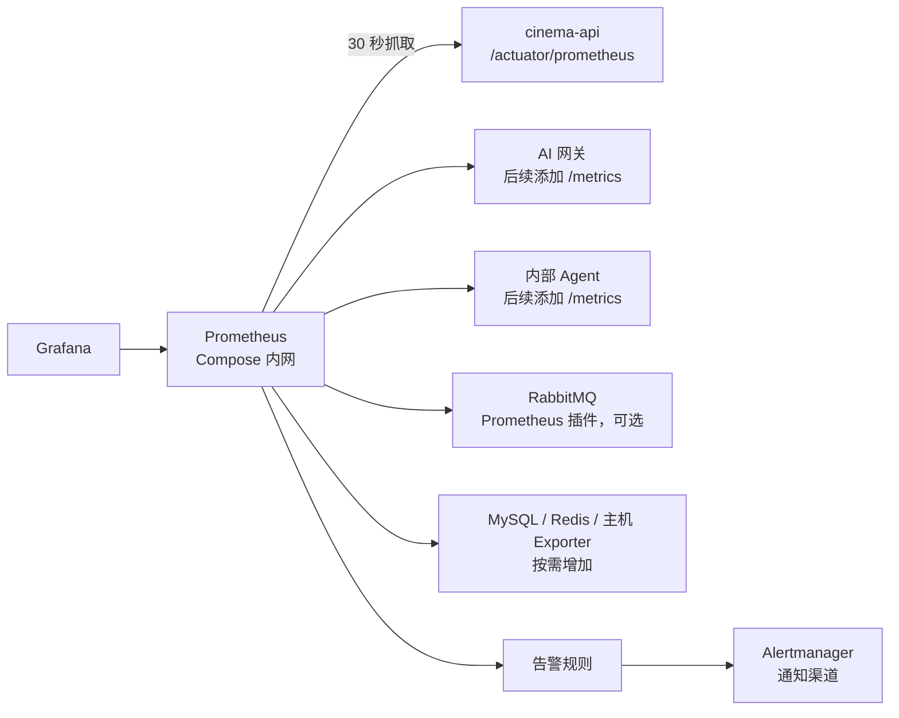

# Prometheus 监控服务方案

**适用项目：** 影院售票与 AI Agent 系统  
**核对日期：** 2026-10-09  
**方案范围：** 在现有 Docker Compose、Spring Boot Actuator 和 Micrometer 基础上，补齐 Prometheus 采集、存储、告警和后续扩展路径。本文分别记录代码库现状、已验证的开发环境部署和后续生产建议。

## 1. 结论

项目已具备 Java 指标出口，不需要从零改造 Java 指标协议。当前 `pom.xml` 已依赖 `spring-boot-starter-actuator` 和 `micrometer-registry-prometheus`；`application.yml` 已暴露 `health`、`info`、`metrics`、`prometheus`，并给指标添加应用名标签。

在原始代码库中，Prometheus 服务、抓取配置、指标持久卷、Grafana 仪表盘和告警管理器都尚未配置；AI 网关与内部 Agent 也没有 Prometheus 指标端点。

**开发环境已验证：** Linux 虚拟机上已通过独立的 `docker-compose.prometheus.yml` 启动 Prometheus 3.5.5，抓取本机开发电脑上的 Java API；`cinema-api` target 已显示 `UP`。Prometheus 配置目前是手动放在虚拟机上的，尚未同步进项目代码库。此方式用于开发验证；开发电脑关机或局域网地址变化时，抓取会中断。

**生产建议：** 将 Prometheus 部署在实际运行 Java API 的服务器或可访问该 API 的私有监控网络中，使用稳定的内部地址，并保持抓取端点不对公网开放。之后再补 Grafana、少量告警以及 Python AI 服务和基础设施指标。

## 2. 代码现状与边界

| 项目位置 | 当前事实 | 对方案的影响 |
| --- | --- | --- |
| `cinema-ticketing-backend/pom.xml` | 已含 Actuator 和 Prometheus Registry | Java 指标格式的依赖已具备 |
| `cinema-ticketing-backend/src/main/resources/application.yml` | 暴露 `health,info,metrics,prometheus`；有 `application` 通用标签 | 可作为抓取出口；生产配置可收窄非必要端点 |
| `cinema-ticketing-backend/docker-compose.yml` | `cinema-api` 属于 `app` profile，没有宿主机端口映射 | Compose 内的 Prometheus 可通过服务名访问 API，不需要公开 Java 端口 |
| `cinema-ticketing-backend/nginx/nginx.conf` | 只显式反向代理 `/actuator/health` | 当前公网入口不会把 `/actuator/prometheus` 代理给访客；保持这一边界 |
| `cinema-ticketing-backend/cinema-ai-gateway/requirements.txt`、`cinema-ai/requirements.txt` | 没有 Prometheus Python 客户端 | AI 网关和 Agent 的请求、SSE 与工具指标需要另行埋点 |
| `个人待处理列表.md` 的 T04 | 标记全链路监控与 AI 成本统计待处理 | Prometheus 只覆盖聚合指标；跨服务 Trace 和准确成本需要分别补齐 |

**实际指标集合尚未从运行中的 `/actuator/prometheus` 逐项核实。** Spring Boot 会自动提供 HTTP、JVM、数据源连接池等常见指标；RabbitMQ 连接工厂和 Lettuce 客户端也有框架侧指标。它们不等价于 RabbitMQ 队列积压、MySQL 内部状态或 Redis 服务端的完整运行指标，后者应通过服务自身插件或 exporter 采集。[Spring Boot 3.4 Metrics](https://docs.spring.io/spring-boot/3.4/reference/actuator/metrics.html)

## 3. 目标架构



采集方向是 Prometheus 主动抓取长期运行服务的指标。Prometheus 和 Grafana 放在 Compose 私有网络；API 服务之间按 Docker DNS 名称通信。不要让 Prometheus 经过公网 Nginx，也不要把业务请求转发到监控服务。[Prometheus 配置说明](https://prometheus.io/docs/prometheus/latest/configuration/configuration/)

## 4. 第一阶段：增加 Prometheus 服务

### 4.1 文件布局建议

```text
cinema-ticketing-backend/
├── docker-compose.yml
└── monitoring/
    └── prometheus/
        ├── prometheus.yml
        └── rules/
            └── cinema.yml
```

镜像不要使用浮动的 `latest`。部署时将 `PROMETHEUS_IMAGE` 设为经核对的固定版本标签；需要固定供应链制品时再锁定镜像 digest。

### 4.2 Compose 服务草案

将以下服务加到 `cinema-ticketing-backend/docker-compose.yml`。这里使用独立 `monitoring` profile，避免当前默认只启动基础中间件的开发流程被监控服务改变。运行完整应用和监控时同时启用 `app`、`monitoring` profile。

```yaml
  prometheus:
    profiles: ["monitoring"]
    image: ${PROMETHEUS_IMAGE:?set a pinned PROMETHEUS_IMAGE}
    restart: unless-stopped
    command:
      - --config.file=/etc/prometheus/prometheus.yml
      - --storage.tsdb.path=/prometheus
    volumes:
      - ./monitoring/prometheus/prometheus.yml:/etc/prometheus/prometheus.yml:ro
      - ./monitoring/prometheus/rules:/etc/prometheus/rules:ro
      - prometheus-data:/prometheus
    # 不发布宿主机端口。Grafana 在 Compose 内网可通过 http://prometheus:9090 访问。
    # 本地临时调试时可单独覆盖为 127.0.0.1:9090:9090。
```

在 `volumes:` 下添加：

```yaml
  prometheus-data:
```

TSDB 数据必须落在持久卷中，避免容器替换后丢失历史曲线。Prometheus 的本地存储应使用本机磁盘，不要将 TSDB 目录放在不受支持的网络文件系统上。下面配置了 14 天时间上限；监控卷容量确定后，再启用并调整 `storage.tsdb.retention.size`，给压缩和清理留出余量。Prometheus 建议 blocks 大小上限不超过分配磁盘空间的 80–85%，此外还需考虑 WAL 和 Head 数据的峰值空间。[Prometheus 存储与保留策略](https://prometheus.io/docs/prometheus/latest/storage/)、[Prometheus 配置说明](https://prometheus.io/docs/prometheus/latest/configuration/configuration/)

### 4.3 抓取配置草案

保存为 `cinema-ticketing-backend/monitoring/prometheus/prometheus.yml`：

```yaml
global:
  scrape_interval: 30s
  scrape_timeout: 10s
  evaluation_interval: 30s

storage:
  tsdb:
    retention:
      time: 14d
      # 按监控卷容量设定；启用前要为压缩和 WAL/Head 数据预留磁盘空间。
      # 官方建议 blocks 大小上限最多占 Prometheus 磁盘空间的 80–85%。
      # size: 5GB

rule_files:
  - /etc/prometheus/rules/*.yml

scrape_configs:
  - job_name: prometheus
    static_configs:
      - targets: ["prometheus:9090"]

  - job_name: cinema-api
    metrics_path: /actuator/prometheus
    static_configs:
      - targets: ["cinema-api:8080"]

  # 开启 rabbitmq_prometheus 插件后再启用：
  # - job_name: rabbitmq
  #   metrics_path: /metrics
  #   static_configs:
  #     - targets: ["rabbitmq:15692"]

  # Python 服务完成 /metrics 埋点后再加入对应目标。
```

`/actuator/prometheus` 是 Prometheus 抓取地址；`/actuator/metrics` 用于人工诊断指标名称和当前值，不用它代替抓取接口。Spring Boot 官方也把 Prometheus 方案定义为对各服务实例进行周期性 scrape。[Spring Boot 的 Prometheus 配置示例](https://docs.spring.io/spring-boot/3.4/reference/actuator/metrics.html)

### 4.4 本地运行方式

现有项目把应用服务放在 `app` profile 下、监控服务放在 `monitoring` profile 下。启用完整应用及监控的命令为：

```powershell
docker compose --profile app --profile monitoring up -d
```

如果需要从宿主机浏览 Prometheus 页面，本地开发覆盖配置应只绑定回环地址：

```yaml
services:
  prometheus:
    ports:
      - "127.0.0.1:9090:9090"
```

生产环境优先通过 VPN、SSH 隧道或已有受控的内部入口访问，不直接把 `9090` 暴露到公网。

### 4.5 已验证的开发环境部署

2026-10-09 按以下实际环境完成了端到端抓取验证。此处是当前开发机拓扑，和“Java API 与 Prometheus 同处 Compose 网络”的生产草案分开记录：

- Vite 前端运行在 `http://localhost:5173`，开发代理将 `/api` 转发到 `http://localhost:8080`；Java API 的 `/actuator/health` 返回 `UP`，`/actuator/prometheus` 返回指标文本。
- Linux 虚拟机上的 Compose 默认只运行 MySQL、Redis、RabbitMQ；Compose 文件中虽定义 `app` profile 服务，当前并未在该虚拟机启动 Java API、AI 或 Nginx 容器。
- 虚拟机通过开发电脑的局域网地址访问 `8080/actuator/prometheus`，HTTP 状态为 200。虚拟机上 Prometheus 查询 `up{job="cinema-api"}` 的值为 `1`，Targets 页面状态为 `UP`。
- 虚拟机新增 `docker-compose.prometheus.yml`，使用固定镜像 `prom/prometheus:v3.5.5`、14 天保留期、持久卷，并将 UI 绑定到虚拟机的 `127.0.0.1:9090`。当前通过 SSH 隧道在开发电脑浏览器查看 Prometheus UI。
- `monitoring/prometheus/prometheus.yml` 使用当前开发电脑的局域网 IPv4 作为 scrape target。该地址可能变化；变更后需更新目标配置并重启或重载 Prometheus。此配置只适用于当前开发网络，不应直接作为生产环境目标地址。

建议后续把虚拟机上的 Prometheus Compose 覆盖文件和抓取配置同步到项目仓库，并通过稳定的服务地址管理 target；正式部署时，将抓取目标改为生产 Java API 的内网地址。

## 5. 指标范围与分阶段扩展

### 阶段一：Java 服务基础指标

- `http.server.requests`：请求量、响应状态和请求耗时；重点看 5xx 比例及 URI 模板级耗时。
- JVM：堆使用、GC 次数和耗时、线程数、进程 CPU。
- HikariCP：活跃、空闲、最大连接数及连接等待情况。
- Redis/Lettuce 与 RabbitMQ 客户端：调用延迟和连接相关指标。

如果要计算可跨实例聚合的 p95/p99，需为相应 Timer 启用直方图或 SLO buckets；未配置直方图时不要假设 Prometheus 一定能算出正确的跨实例 percentile。Spring Boot 的 `management.metrics.distribution.percentiles-histogram` 支持按指标开启直方图。[Spring Boot 分布统计配置](https://docs.spring.io/spring-boot/3.4/reference/actuator/metrics.html)

### 阶段二：票务业务指标

用固定枚举做结果维度，帮助判断用户流程是否异常：

| 指标建议 | 类型 | 标签示例 | 用途 |
| --- | --- | --- | --- |
| `cinema_seat_lock_total` | Counter | `result=success\|conflict\|error` | 区分正常座位竞争和服务异常 |
| `cinema_order_create_total` | Counter | `result=success\|rejected\|error` | 观察下单成功和失败趋势 |
| `cinema_order_timeout_total` | Counter | `source=delay_queue\|reconcile` | 检查超时取消的主流程与补偿流程 |
| `cinema_order_reconcile_total` | Counter | `result=cancelled\|skipped\|error` | 发现补偿任务持续失败 |
| `cinema_order_create_duration_seconds` | Histogram | 固定业务阶段 | 观察下单耗时分位数 |

订单号、用户 ID、座位 ID、影片 ID、影院 ID、请求全文和原始 URL 都不要作为 Prometheus 标签。这些值无界增长，也可能包含敏感业务信息。Prometheus 的每个唯一标签组合都会形成新的时间序列；高基数标签会增加内存和存储开销。[Prometheus 标签建议](https://prometheus.io/docs/practices/naming/)

### 阶段三：AI 网关与 Agent

当前 Python requirements 没有 Prometheus 客户端。后续可为 FastAPI 服务增加官方 `prometheus-client`，将指标挂到内网 `/metrics` 路由。[Prometheus Python Client](https://github.com/prometheus/client_python)

建议优先采集：

- Dify 与内部 Agent 的请求量、错误数、调用总时长。
- SSE 首段耗时、生成时长、正在生成的请求数和用户停止数。
- 内部 Agent 固定工具调用的工具类别、结果类别和耗时。
- Redis 会话错误、限流拒绝、Dify 限流或上游服务不可用次数。
- 上游确实返回的 Token 用量；供应商未返回的用量单独作为估算值，不混成真实账单。

标签限制为固定值，例如 `route=faq|live`、`provider=dify|internal_agent`、`result=success|timeout|upstream_error`、`tool=movie|screening|own_order|refund_policy`。不采集提示词、用户问题、账户、聊天 ID 或订单号。Dify 工作流内部各节点是否能取到指标，取决于 Dify 本身是否提供相应接口；本服务侧只能可靠统计网关观察到的调用结果和耗时。

### 阶段四：基础设施指标

- **RabbitMQ：优先考虑内置插件。** RabbitMQ 提供 `rabbitmq_prometheus` 插件，默认在 `15692/metrics` 暴露 Prometheus 格式指标；需要显式启用插件。先用聚合指标观察节点状态、消息速率和队列积压；每个连接/队列的明细会显著增加数据量，等确有排查需求再打开。[RabbitMQ Prometheus 监控](https://www.rabbitmq.com/docs/prometheus)
- **MySQL：** 后续部署 MySQL exporter，重点监控连接、运行状态、慢查询和锁等待。Exporter 应使用权限受限的监控账户。
- **Redis：** 后续部署 Redis exporter，重点监控可用性、内存、连接数、命中率和淘汰情况。
- **主机与容器：** 需要主机 CPU、内存、磁盘和容器资源趋势时再加入 Node Exporter 和容器指标采集。Exporter 保持 Compose 内网可访问，不额外公开宿主机端口。

## 6. 告警建议

Prometheus 会计算告警表达式；要通过邮件、短信或团队 IM 发通知，还需要 Alertmanager 和已配置的接收渠道。第一批规则只覆盖用户可感知或会导致积压的问题：

1. `cinema-api` 抓取目标连续 2 分钟不可用。
2. Java 5xx 比例持续超过团队确认的阈值。
3. HTTP p95 超过服务目标并持续一段时间。
4. Hikari 活跃连接持续接近上限，或等待连接持续增长。
5. RabbitMQ 队列积压、未确认消息或死信持续增长。
6. 超时订单对账失败持续出现。
7. AI 网关或内部 Agent 持续不可用，Dify 上游错误率明显升高，或首段响应时间超出体验目标。
8. Prometheus 所在磁盘接近上限。

起步规则示例（保存为 `monitoring/prometheus/rules/cinema.yml`）：

```yaml
groups:
  - name: cinema-availability
    rules:
      - alert: CinemaApiScrapeMissing
        expr: up{job="cinema-api"} == 0
        for: 2m
        labels:
          severity: critical
        annotations:
          summary: "影院 Java API 指标目标不可抓取"
          description: "检查 cinema-api 容器状态、Compose 网络及 /actuator/prometheus。"
```

阈值需基于实际运行基线和用户体验目标确认；先观察数据，再确定 p95 和错误率阈值。不要把正常抢座冲突、用户取消或上游短暂抖动都告成严重故障。告警应有负责人和处理步骤，避免只发通知但无人跟进。

## 7. 安全、资源与运维要求

### 网络与访问控制

- Prometheus、Grafana 和各 Exporter 不公开映射到公网。
- 生产环境 Nginx 继续只转发必要的健康检查路由，不新增公开的 `/actuator/prometheus` 或 `/metrics` 路由。
- Prometheus Web UI 可访问所有采集到的时间序列和运维信息，应作为内部管理接口保护。Prometheus 官方安全模型明确建议不要把 Prometheus 组件端点直接暴露在公网。[Prometheus Security Model](https://prometheus.io/docs/operating/security/)
- 当前 Compose 将 MySQL、Redis、RabbitMQ AMQP 与管理端口映射到宿主机。若这份 Compose 会部署到公网 VM，应改成仅回环绑定或通过防火墙限制来源，不要因为新增监控服务而扩大暴露面。
- 指标不得包含密钥、访问令牌、提示词、用户输入或可识别用户的数据。

### 容量与保留

- 初始抓取间隔 30 秒；有明确的快速告警需求后再缩短。
- 起步保留时间 14 天。另设磁盘大小上限时，确保预留压缩期间所需空间；Prometheus 官方建议容量上限不要贴近监控卷可用空间上限。
- 重点关注时间序列数、每次抓取样本数、TSDB 卷使用量和 Prometheus 查询负载。
- 不预设固定 CPU/内存配额。先在目标 VM 上观察 Prometheus 与应用的资源，再设置 Compose 限额，避免小机器内存不足或限额过紧。
- 单机 Compose 的 Prometheus 会与应用共享宿主机，并且应用宕机时监控也可能一起中断。若监控需要独立于业务主机工作，后续迁移到外部监控主机或托管 Prometheus。

### 指标与日志、链路追踪的分工

- Prometheus：看时间序列、总量、错误率、延迟分位数、队列和资源趋势。
- 日志：保留 Java 当前的 Trace ID 和错误上下文，排查某次具体请求。
- 分布式追踪：后续让 Trace ID 从浏览器/网关传到 Agent、MCP、Java，定位单次 AI 查询在哪个内部步骤变慢。

**不要把 Trace ID 当作指标标签。** 一个请求一个 ID 会产生持续增长的时间序列。T04 的“统一关联 ID、SSE 首段耗时、工具错误率、Token/费用”需拆成低基数指标和 Trace/日志字段分别实现。

## 8. 验收清单

### Prometheus 基础服务

- `promtool check config` 能通过主配置与规则文件校验。
- 通过 `app` 和 `monitoring` profiles 启动后，Prometheus 页面或 API 中 `cinema-api` target 为 `UP`。
- `up{job="cinema-api"}` 为 `1`，可查询 Java HTTP、JVM 和连接池指标。
- 重建 Prometheus 容器后，保留期内的历史指标仍存在。
- Prometheus 与 Actuator 抓取端点不能从公网直接访问。

### 业务与 AI 扩展

- 抢座冲突可以与 Redis 错误分别观察。
- 超时取消消息和数据库对账的结果可以区分。
- AI FAQ/Dify、实时 Agent 和各 Java 工具调用分别有有限基数的结果和耗时指标。
- 指标标签中不含用户、订单、会话、提示词或密钥值。
- 告警规则在测试环境触发后，Alertmanager 能发到配置好的通知渠道，并附带处理说明。

## 9. 分阶段实施顺序

1. **第一步：** 新增 Prometheus 服务、配置文件、持久卷与 Java scrape target；验证配置、目标状态、数据持久化和公网隔离。
2. **第二步：** 加 Grafana，只做服务健康、API 延迟与错误、JVM、HikariCP 四类面板；接一条 Java target down 告警。
3. **第三步：** 添加票务业务 Counter/Histogram、Python AI 网关和 Agent 指标，再配置订单补偿和 AI 上游告警。
4. **第四步：** 按排障需求加 RabbitMQ、MySQL、Redis、主机和容器指标；评估磁盘、时间序列数量与告警误报后，再讨论外部或托管监控。

**当前建议先完成第一步和第二步。** 这会用较低的业务代码改动，给现有 Java API 建立可查询的运行基线；全链路 Trace 与 AI 成本统计仍需单独实施。
