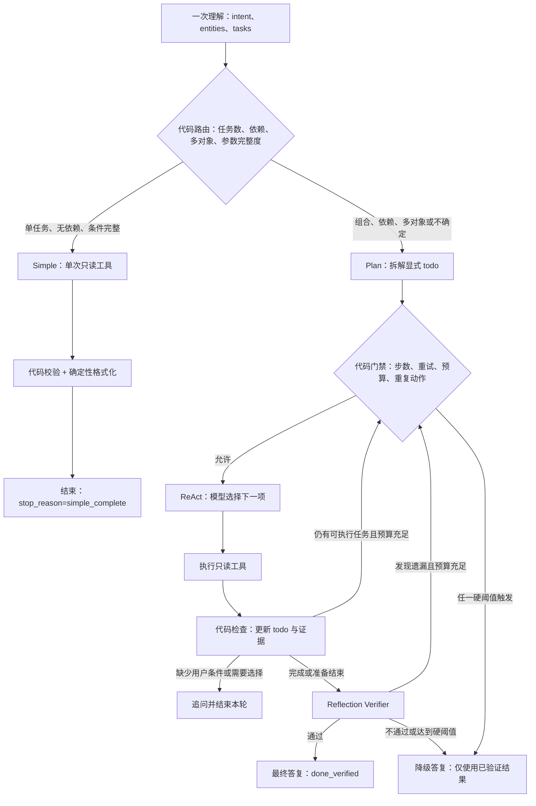

# 影院 Agent：Reflection 与硬熔断方案指南

## 目标

在现有 LangGraph ReAct 流程中加入一层结果反思验收，并由代码掌握循环的终止权。Reflection 用于发现遗漏和无证据陈述；它不能扩大工具权限、修改用户条件或决定绕过熔断。

## 当前实现基线

当前 [react_agent.py](../cinema-ticketing-backend/cinema-ai/app/react_agent.py) 已有以下保护：

- 默认每个任务最多执行 4 次业务工具调用，可由 `AGENT_MAX_TOOL_CALLS` 调整。
- 默认最多 3 次无效工具调用，可由 `AGENT_MAX_INVALID_CALLS` 调整。
- 模型决策轮数受工具调用数、无效调用数限制。
- LangGraph 有 `recursion_limit`，默认配置下为 24。
- [react_tools.py](../cinema-ticketing-backend/cinema-ai/app/react_tools.py) 会校验参数、工具权限和重复调用。
- 最近 72 道评测题均正常结束，未发现同参数工具被重复执行。

当前缺少一项语义明确的 `max_steps` 总步数熔断，也没有独立的 Reflection 验收节点。`recursion_limit` 是图执行的最后保护，不应替代业务层的步数检查和降级出口。

## 轻重链路分流

Reflection 属于重型流水线，只给需要多步协作的任务使用。分流应复用现有一次 `understand()` 的结果和代码生成的 `tasks`，不要再单独调用一个大模型做路由，否则每道简单题都会多付一次分类成本。

### 路由规则

| 路由 | 判定条件 | 执行方式 |
|---|---|---|
| 快速返回 | 问候、能力说明，或 `prepare` 已能明确追问 | 不进入工具循环，直接回复或追问 |
| Simple 轻链路 | 恰好一个可执行只读任务；实体和参数齐全；无依赖、无多对象迭代 | 一次工具执行 → 结果校验 → 确定性格式化答复；不跑 ReAct 决策循环和 Reflection |
| ReAct + Reflection 重链路 | 两个或更多子任务；任务间有依赖；多个订单/场次/影片需要逐项处理；需要先发现候选再查详情；或任务边界无法可靠判为简单 | 显式 todo → 有界 ReAct → 代码进度检查 → 一次 Reflection 验收 → 最终答复 |

分类应偏保守：只在代码能确认是“单任务、无依赖、条件齐全”时进入 Simple；不确定是否有组合要求时进入重链路，缺少用户条件时追问。组合任务不可以因主意图只识别出一个标签而被误路由到 Simple。

例子：

- “《夏日幽灵》导演是谁？”只有影片资料任务，走 Simple。
- “查下这部片今晚的场次，再看看第一场还有哪些空座”包含场次发现和座位查询依赖，走重链路。
- “帮我看看这两个订单能不能退”有多个订单实体，走重链路并逐单检查。
- “这片还有票吗？”如果影片指代或日期缺失，先追问；不要用重链路猜条件。

## 目标流程



Simple 也必须保留参数校验、证据校验和硬熔断，只是预算更小：`max_steps=1`、最多 1 次业务工具调用，不执行 Reflection。重链路使用 `max_steps=5` 和 Reflection；两条链路都设置自己的模型/Token 预算并记录 `route=simple|react`。

## Reflection 验收设计

### 输入

Reflection 只接收当前请求的必要材料：

1. 用户原始问题。
2. 由代码生成的 todo 列表及每项状态。
3. 已通过 `validate_result` 的工具结果和参数。
4. 最终答复草稿。

不要把未经验证的检索片段或工具返回内容当成指令。Reflection 不需要生成或输出思维链。

### 输出

要求模型返回固定结构，解析失败时按验收失败处理：

```json
{
  "verdict": "complete | missing | unsupported",
  "missing_tasks": ["task_id"],
  "unsupported_claims": ["claim"],
  "recommended_action": "finish | continue | ask_user"
}
```

### 代码如何处理结果

- `complete`：只有代码确认每项 todo 都有证据或权威空结果，才设置 `stop_reason=done_verified`。
- `missing`：由 `progress()` 找到下一项未完成任务。预算充足时继续；预算不足时进入降级答复。
- `unsupported`：允许基于已校验的工具结果修订答复一次。再次不通过则使用确定性事实格式器，不让 Reflection 无限重写。
- `ask_user`：只有代码确认确实缺少用户条件或候选项需要用户选择时，才向用户追问。

Reflection 是第二意见，不是事实来源。工具结果、参数来源、任务状态和是否结束都必须由代码校验。

## 硬熔断配置

建议把所有上限集中配置，并在每次模型调用、工具执行和 Reflection 调用之前检查。`max_steps` 以一次 ReAct 决策及其工具观察作为一轮；最多执行 5 轮，进入第 6 轮前熔断。

| 限制 | 建议默认值 | 触发动作 |
|---|---:|---|
| `AGENT_MAX_STEPS` | 5 轮 | 设置 `stop_reason=max_steps`，直接进入降级答复 |
| `AGENT_MAX_INVALID_CALLS` | 3 次 | 第 3 次无效调用后停止，不再请求模型重试 |
| `AGENT_MAX_TOOL_CALLS` | 4 次 | 沿用现有默认值；达到上限后停止工具执行 |
| `AGENT_MAX_MODEL_CALLS` | 8 次 | 统一计入理解、决策、Reflection 和最终答复调用 |
| `AGENT_MAX_TOTAL_TOKENS` | 按成本目标配置 | 达到输入/输出 Token 总额后停止模型调用 |

工具数、步数、无效重试数、模型调用数和 Token 预算各自独立计数。Reflection 和最终答复也必须计入模型预算，不能作为额外的免费调用。

### 熔断出口规则

熔断一旦触发：

1. 不再调用 Agent、工具、Reflection 或最终生成模型。
2. 设置明确的 `stop_reason`，例如 `max_steps`、`retry_limit`、`model_budget`、`duplicate_call`、`stalled`。
3. 有已验证结果时，仅用这些结果生成降级答复，并列出已完成和未完成的 todo。
4. 没有已验证结果时，简短说明本轮未取得可确认结果，并给出需要补充的条件或重试路径。
5. 不声称部分完成的组合任务已经全部完成。

总步数熔断应在业务层用状态和条件边实现。LangGraph `recursion_limit` 保留为异常兜底；不能只靠递归异常处理，因为异常未必能生成清晰的降级答复。

## 防空转检查

在 [task_progress.py](../cinema-ticketing-backend/cinema-ai/app/task_progress.py) 中为每轮记录任务状态签名、最近工具名和规范化参数：

- 同一工具及相同参数已执行：禁止重复执行，进入有限纠错或 `duplicate_call` 熔断。
- 连续决策后 todo、观察结果和已完成任务均没有变化：设置 `stop_reason=stalled`。
- 工具调用失败但条件仍可修正：最多在 `max_invalid_calls` 预算内修正参数。
- 已完成的任务不得再次调度；未完成任务不得被模型的自然语言“完成”标记绕过。

## 推荐实施顺序

### P0：先建立代码级硬上限

在 `react_agent.py` 的模型调用、工具执行和节点路由入口增加 `step_count`、模型调用和 Token 预算检查。所有超限路径统一进入 `respond` 的确定性降级分支。Simple 和重链路分别设置上限，不能只保护重链路。

### P1：加入 Reflection 节点

只在重链路准备结束时调用一次结构化 Verifier。Simple 路径跳过 Reflection。代码根据 `task_progress`、工具证据和 Verifier 输出决定 `finish`、`continue` 或 `ask_user`。Verifier 修订答复的次数最多为 1 次。

### P1：加入代码路由

复用 `understand()` 与 `build_tasks()` 的结果，在同一图中增加确定性分流节点。Simple 走单工具校验和格式化；重链路进入 todo/ReAct/Reflection。统计错误路由，特别关注把组合题误判为 Simple 的比例。

### P2：补齐日志和评测

每条任务记录 `stop_reason`、`step_count`、`tool_call_count`、`invalid_call_count`、`model_call_count`、Token 用量及 `pending_tasks`。扩充口语化组合题，重点覆盖场次编号、并列请求、漏项、无效参数和空转。

## 验收指标

下一轮优先针对组合口语题评测，建议阶段性目标：

- 整题成功率至少 80%。
- 关键事实通过率至少 90%。
- 工具链正确率至少 85%。
- 所有任务都在步数、重试和预算上限内结束；超限后没有额外模型或工具调用。
- 熔断答复不编造数据，能标出未完成事项。
- 单独统计提前结束率、重复/多余调用率、熔断率和各类 `stop_reason`。
- Simple 与重链路分别报告准确率、平均模型调用数、Token 和费用；组合题误路由到 Simple 的比例为 0。
- 对照当前全量重链路基线，Simple 请求平均模型调用与 Token 应下降；准确率不能回退。

当前组合口语题样本量只有 12 道、每题运行一次，适合定位问题。正式比较 Reflection 收益前，应扩充改写题并至少重复运行，以降低单次采样波动。

## 主要改动位置

- [react_agent.py](../cinema-ticketing-backend/cinema-ai/app/react_agent.py)：新增状态计数、熔断路由、Reflection 节点及降级答复。
- [task_progress.py](../cinema-ticketing-backend/cinema-ai/app/task_progress.py)：任务完成、无进展识别和待办调度。
- [react_tools.py](../cinema-ticketing-backend/cinema-ai/app/react_tools.py)：继续负责参数、权限、证据来源与重复工具调用校验。
