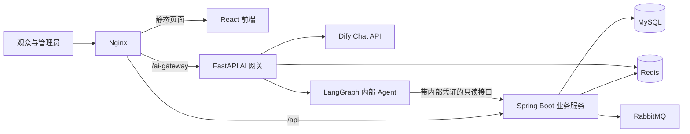

# 影院售票与 AI Agent 项目：面试重点内容及答疑

这份文档用于准备项目介绍和技术面试。建议先熟悉项目主线，再按面试官追问展开细节。回答时优先讲清楚“遇到什么问题、我怎么处理、为什么这样处理、验证结果是什么”，不要只报技术名词。

> **表述口径：** 本项目包含真实实现的票务业务与 AI 查询链路，也包含演示范围。支付和退款未接真实资金渠道；RAG 使用关键词检索，不是向量数据库；并发测试验证数据一致性，不代表系统 QPS。面试中明确这些边界会比夸大指标更可信。

## 一、先准备两段项目介绍

### 30 秒版本

我做的是一个全栈影院售票系统，包含观众购票、管理员排期与内容审核，以及影院 AI 助手。票务后端基于 Spring Boot、MySQL、Redis 和 RabbitMQ，实现选座锁定、订单幂等、模拟支付和超时取消；AI 部分由独立 FastAPI 网关和 LangGraph Agent 提供，支持票务知识问答和本人订单等只读查询。项目重点解决了并发选座时的重复占座，以及 AI 查询业务数据时的身份和权限边界问题。

### 约 90 秒版本

这是一个从影片排期到出票和售后的影院售票项目。管理员维护影片、售票周期、影院、影厅和场次；观众查看可售场次、选座、锁座、创建订单、模拟支付、查看影票，并按当前退票政策申请退票。观影结束或验票后，还可以评价影片，管理员负责审核影评和处理举报。

核心交易由 Spring Boot 服务负责，MySQL 保存订单和票务事实，Redis 承担短期座位锁、缓存和会话，RabbitMQ 处理未支付订单的延迟取消。针对并发一致性，我使用 Redis Lua 原子锁座、数据库行锁和请求幂等，并用真实 MySQL 和 Redis 做了并发验证。

AI 部分拆成 Dify 常见问答和用户主动转接的内部 Agent。网关负责会话、限流和 SSE 转发；LangGraph Agent 识别意图、澄清缺失信息，并调用固定的 Java 只读接口查询影片、场次、本人订单和退票资格。身份由 Java 签发并验证的短期凭证确定，Agent 不直接访问数据库，也不能替用户支付或退款。当前支付与退款只完成系统内业务演示，没有连接真实支付渠道。

## 二、系统全貌

### 组件关系

### 各组件分别负责什么

- **React + TypeScript + Vite：** 观众购票和管理员操作界面；处理订单、选座图、影评、聊天和 SSE 展示。
- **Spring Boot：** 登录鉴权、业务参数校验、排期、座位、订单、支付状态、退票、验票和影评等业务规则。
- **MySQL：** 保存用户、影片、影院、影厅、场次、订单、订单明细、支付流水、退款记录和评价等持久业务数据。
- **Redis：** 保存短期座位锁、登录 token、目录缓存、AI 会话、限流计数和流式请求租约。
- **RabbitMQ：** 通过延迟队列和死信交换机触发订单超时取消，失败消息有限次重试并进入失败队列。
- **Python AI 服务：** FastAPI 提供 LangGraph Agent，执行意图识别、参数澄清、固定工具调用、结果校验和回复生成。
- **AI 网关：** 分流 Dify 与内部 Agent，管理聊天会话、转接凭证验证、反馈、限流和 SSE 转发。
- **Nginx 与 Docker Compose：** 提供统一入口并编排前端、Java 服务、AI 服务与中间件。

### 项目主要数据关系

- 一部影片可以有多个放映场次；一个场次对应一间影厅、一个开场时间和票价。
- 一个影院包含多间影厅；一间影厅维护固定座位布局，并且排期不能重叠。
- 一个订单属于一名观众和一个场次，包含一个或多个座位项目。
- 支付、退款、验票和影评分别保留记录，方便判断订单生命周期及后续处理。
- **订单**是一次购票记录；**电影票**是订单内对应某个座位的入场权益。一单可以包含多张电影票。

## 三、核心业务流程怎么讲

### 1. 浏览与排期

管理员维护影片状态和售票时间窗口，再给影院影厅安排场次。系统区分“影片是否上映”和“当前是否有可购买场次”：上映中不代表一定有可订场次。可售场次还要满足场次未开始、影片处于销售窗口、影院和影厅启用等条件。

排期检查使用“开场时间 + 影片片长 + 20 分钟周转时间”计算影厅占用区间，避免前一场未散场、清洁时段和下一场排期重叠。售票开始和结束时间按业务查询实时计算，不需要定时任务改写影片状态。

### 2. 选座和锁座

1. 页面先读取影厅座位布局以及该场次已有订单占用的座位。
2. 登录用户选择最多 6 个座位，服务端检查座位确实属于当前影厅、状态可用且没有有效订单。
3. Redis Lua 脚本先检查所有座位锁是否都不存在，全部可用后再一次性写入锁；只要一个冲突，就一个也不加。
4. 锁带有持有人标识和 5 分钟 TTL。释放时也检查持有人，避免误删其他人的锁。

### 3. 创建、支付和出票

- 创建订单时服务端再次核验场次、座位、Redis 锁持有人和数据库中的有效订单，不能只信任前端座位图。
- 订单金额由服务端用场次票价乘以座位数计算，客户端不提供可信金额。
- 订单先进入 `UNPAID`，有效期 5 分钟；请求号 `requestId` 用于重复提交时返回同一订单。
- 当前支付是模拟成功：写入支付流水后，在同一业务事务中将订单从 `UNPAID` 更新为 `PAID`，再把订单明细标为已出票并将订单更新为 `ISSUED`。因此一次成功响应中通常直接看到 `ISSUED`。
- 支付流水号 `paymentNo` 用于支付幂等；相同订单和相同流水号重试可返回现有订单，冲突流水号会被拒绝。

### 4. 取消和退票

- 观众主动取消只允许操作未支付订单；订单和票项一起改为 `CANCELLED`，然后按持有人释放座位锁。
- 到期订单由 RabbitMQ 延迟消息触发取消。消费者锁定订单行并再次核对 `UNPAID` 和到期时间；如果订单已经支付或取消，就不重复处理。
- 定时对账每分钟扫描过期的未支付订单，作为消息丢失或处理失败时的补偿。
- 只有已出票且未验票的订单可以按规则整单退票。截止时间来自数据库中当前启用的退票政策，校验和更新都由后端执行。
- 当前退款只将订单和票项标记为已退、写入退款记录；没有调用第三方支付渠道退回资金。

### 5. 影片评价和 AI 助手

- 影评人需要有该影片对应的有效已出票票项，且场次已经结束或票项已验票。审核通过并满足观影资格的影评才公开并进入平均分。
- Dify 负责常见对话；用户需要实时订单等业务信息时，点击转接后才启动内部 Agent。
- 内部 Agent 仅能查询。下单、支付和退票必须回到正式业务页面，由 Java 服务执行完整校验和状态更新。

## 四、设计重点及面试答疑

每个答案都可以按自己的实际工作调整成第一人称。先说项目里怎么做，再讲这样做解决了什么问题。

### A. 项目和架构

#### 1. 你负责的项目是什么？解决了什么问题？

**回答示例：**

这是一个影院售票全栈项目，主要解决观众找场次、选座下单和查看订单的问题，也提供管理员排期和售后管理。技术上的重点有两个：第一是多人同时抢座时保证座位和订单状态一致；第二是让 AI 能查询实时票务数据，同时不让模型绕过 Java 的权限和交易规则。AI 不直接替用户完成交易。

#### 2. 为什么选择影院售票作为项目场景？

**回答示例：**

影院售票有完整、容易解释的业务闭环：影片和场次管理、座位竞争、订单、支付、超时释放、退票和验票。它既有常规 CRUD，也有并发和状态机问题，能展示我如何把具体业务规则映射到数据库、缓存和消息处理里。再加上 AI 问答后，可以说明模型如何在权限受控的情况下调用现有业务能力。

#### 3. 整体架构是怎样的？

**回答示例：**

前端使用 React；Java Spring Boot 是票务业务入口，负责鉴权、事务和状态；MySQL 保存业务事实，Redis 保存短期锁和缓存，RabbitMQ 处理延迟取消。AI 侧分成 FastAPI 网关和内部 Agent：网关管理聊天和流式连接，Agent 用 LangGraph 编排固定查询工具。Agent 通过内部鉴权 HTTP 接口调用 Java，不直连数据库。

#### 4. 为什么不是把所有代码都放在一个服务里？

**回答示例：**

票务核心业务目前采用 Java 模块化单体，影片、订单、评价等模块仍在一个 Spring Boot 服务中。这样订单和座位变更可以直接使用同一数据库事务，也减少服务间调用和分布式事务复杂度。AI 服务单独拆出，是因为 LangChain、LangGraph 和模型 SDK 属于 Python 生态，AI 迭代和 SSE 长连接也适合独立部署。代价是多了内部 HTTP、服务凭证和部署配置，需要明确边界。

#### 5. 为什么 AI 不直接连 MySQL？

**回答示例：**

如果把数据库账号交给模型或 Agent，查询范围、订单归属和 SQL 都会更难控制。我把查询封装成固定的 Java 内部接口，Java 用参数化查询并根据可信身份限制本人订单。模型只能选业务工具、传查询条件，不能拼任意 SQL。这样权限和业务规则仍由熟悉业务状态的 Java 服务决定。

#### 6. 为什么选 Spring Boot、MyBatis 和 JdbcTemplate？

**回答示例：**

Spring Boot 负责 Web、依赖管理、事务、Redis 和 RabbitMQ 集成，适合组织核心业务服务。项目里部分账户和影院查询使用 MyBatis Mapper；一些通用管理查询和动态 SQL 使用 JdbcTemplate，减少大量重复 Mapper 样板代码。并不是所有数据库访问都强行套在 MyBatis 上，复杂查询仍保持参数化和服务层校验。

#### 7. 数据库主要有哪些实体？

**回答示例：**

核心包括用户、影片、影院、影厅、座位、场次、订单、订单明细、支付流水和退款记录。影片关联场次，影院关联影厅，影厅关联座位；订单关联一个用户和一个场次，订单明细记录各个座位。支付和退款独立成记录，避免把所有生命周期信息塞进一个订单字段里。

#### 8. 影片状态和售票状态有什么区别？

**回答示例：**

影片状态描述影片自身处于待上映、上映中还是下架；售票状态描述此刻是否存在可以购买的未来场次。上映中的影片可能没有任何排期，因此不能只看影片状态就显示“可购买”。系统需要综合售票时间窗、未来场次、影院和影厅状态计算。

### B. Redis、数据库和购票一致性

#### 9. Redis 锁座具体怎么保证原子性？

**回答示例：**

普通写法是先逐个查座位锁，再逐个设置锁。两个请求可能同时查到“都没人锁”，最后都认为自己成功。项目使用 Lua 把“检查全部锁”和“设置全部锁”放在 Redis 的一次原子执行中：先检查全部 key，只要有冲突立即失败；只有全部通过才统一设置，并配置 5 分钟过期时间。

**通俗解释：** 就像售票员先检查一组座位是否全部空着，确认后一次性挂牌；不会先挂上两个，再发现第三个已被别人选走，留下半组锁。

#### 10. 为什么 Redis 锁之外还要查 MySQL？

**回答示例：**

Redis 锁解决短时间内多人同时操作的问题，但锁会过期、可能被清理，也不代表已经成功下单。MySQL 中的有效订单才是已经占座的持久事实。创建订单时我会再次锁定座位数据库行、检查有效订单和 Redis 锁持有人；只有数据库与锁都符合条件，才创建订单。这是“快速协调”和“持久状态”两层保护。

#### 11. 座位锁为什么要有持有人校验和 TTL？

**回答示例：**

持有人校验保证释放动作只删除自己设置的锁，避免用户 A 的请求误删用户 B 的锁。TTL 负责处理浏览器关闭、断网或用户离开等没有执行显式解锁的情况。TTL 到期后锁自动释放，但创建订单时仍会在 MySQL 检查是否有有效订单，所以不能把 TTL 当成订单状态。

#### 12. 什么是幂等？项目里如何实现？

**回答示例：**

幂等就是同一操作因为重试执行多次，最终结果仍像执行了一次。网络超时后，前端可能不知道下单是否成功，于是会重试。创建订单带 `requestId`，同一用户重复提交会找回并返回已有订单；数据库唯一约束也防止同一请求号出现多笔记录。支付使用 `paymentNo` 判断重复流水。

**注意补充：** 幂等键要有作用域。这里下单幂等键结合用户身份和请求号，不是全站只看一个请求号。

#### 13. 为什么总价必须由服务端计算？

**回答示例：**

浏览器里的价格可以被修改，不能作为支付和订单事实。服务端根据数据库里该场次的票价和通过校验的座位数量重新计算订单金额，再写入订单。前端只负责展示，后端负责最终金额和状态校验。

#### 14. 支付流程和状态机怎么设计？

**回答示例：**

待支付订单只能从 `UNPAID` 进入支付流程。后端先锁定订单行，检查订单归属、状态和过期时间，再插入唯一支付流水；随后将订单更新为 `PAID`，把票项标记为 `ISSUED`，最终把订单更新为 `ISSUED`。这些数据库更新在一个事务内完成。重复使用相同流水号可以返回已有成功结果，不同流水号不能重复支付同一订单。

#### 15. 这个项目接了什么支付渠道？

**回答示例：**

目前没有接真实支付渠道。前端使用演示支付流水号，后端模拟支付成功并验证订单状态、流水号幂等和出票流程。这样可以验证系统内部订单闭环，但不能说已经完成真实扣款或资金退款。后续接支付平台时，需要增加支付回调验签、金额核对、回调幂等、退款接口和对账。

#### 16. 为什么一个订单既有订单状态，又有票项状态？

**回答示例：**

订单代表一笔购买交易，票项代表订单里每个座位对应的入场权益。整单退票时两者都会更新；验票通常需要精确到一张票，某一张票验票后也能用于阻止整单退票。两层状态各自描述不同对象，不能简单合并。

#### 17. 退票规则为什么放数据库，不写死在代码里？

**回答示例：**

退票截止时间和说明可能调整。如果写死在代码中，每次规则变化都要重新发布服务。规则放在数据库后，管理员可以管理当前启用策略，订单详情、AI 查询和退票校验都读取当前策略。前端显示的倒计时只是提示，最后是否可退仍由后端重新校验。

#### 18. 如何防止支付与超时取消同时发生？

**回答示例：**

支付和超时取消都要检查订单状态，并通过数据库订单行锁串行处理。支付路径要求订单仍是未过期的 `UNPAID`；取消路径也只允许把 `UNPAID` 改为 `CANCELLED`。谁先成功改变状态，另一条路径重新读取后就不能再做相反的转换。座位释放也按锁持有人校验。

### C. RabbitMQ 与异步任务

#### 19. 订单超时取消的消息链路是什么？

**回答示例：**

订单创建事务提交后，发布一条带过期时间的延迟消息到延迟队列。消息过期后经死信路由进入取消队列，消费者再检查订单是否仍未支付并已经到期，然后更新订单和票项、释放 Redis 锁。消费者使用手动 ACK，失败时最多重试 3 次，最后进入失败队列。

#### 20. 为什么延迟消息不能直接取消订单？

**回答示例：**

消息可能延迟、重复投递或在用户支付后才到。消息只是“该检查这笔订单了”的通知，不是取消命令。消费者必须以数据库当前状态为准，只有订单仍处于 `UNPAID` 且已到期才取消。这样即使消息晚到或重复，也不会误取消已支付订单。

#### 21. RabbitMQ 失败后怎么补偿？有没有事务消息？

**回答示例：**

当前创建订单的消息在数据库事务提交后发布，避免数据库回滚但消息已经发出。不过，数据库提交成功后如果发布消息失败，仍然存在消息缺失窗口。项目用每分钟扫描过期未支付订单的定时对账任务补偿这种情况；消费者自身也有有限重试和失败队列。

当前没有实现完整的 Transactional Outbox。若进入要求更高的生产环境，我会把待发送事件与订单放进同一个数据库事务，再由独立发布器投递，并增加 Outbox 重试、告警和消息追踪。对账任务目前多实例下可能重复扫描，虽然条件更新能保证只有一方真正取消，但还可以用 `FOR UPDATE SKIP LOCKED` 降低重复工作。

#### 22. 消息消费如何幂等？

**回答示例：**

消息带稳定的 `messageId`，消费时先写入 `message_consume_record`。如果该消息 ID 已处理，唯一约束会让重复消息直接跳过。幂等记录和订单取消在同一个数据库事务中：取消失败时事务回滚，记录也回滚，后续重试仍能处理。

### D. AI、LangGraph、RAG 和权限

#### 23. 为什么同时用 Dify 和内部 Agent？

**回答示例：**

两者负责不同类型的问题。Dify 适合承接常见说明和通用聊天；需要实时查询本人订单、场次或退票资格时，用户主动转接内部 Agent。这样常见问答不用每次进入内部业务查询链路，实时数据也不会依赖 Dify 知识库里的旧快照。两个模式都在同一个聊天入口中，但共享的权限边界由网关和 Java 控制。

#### 24. LangGraph 在这里做什么？流程有几步？

**回答示例：**

LangGraph 用显式状态图表示 Agent 的执行流程，而不是让模型自由地决定所有事情。当前先识别意图和参数；缺少订单号或日期时进入澄清节点；信息足够后调用固定工具；接着检查工具是否返回有效结果，再生成回复。主要节点是意图、澄清、执行、校验和回答。流程清楚后更容易定位失败发生在理解、查询还是生成阶段。

#### 25. Agent 能调用哪些业务工具？

**回答示例：**

当前固定为六类：`search_movies` 影片查询、`search_screenings` 场次查询、`query_order` 本人订单查询、`query_ticket_policy` 退票规则与知识问答、`recommend_movies` 影片推荐、`check_refund_eligibility` 退票资格查询。工具参数经过意图和实体提取，再传给 Java 内部接口。没有通用 SQL 工具、下单工具、支付工具或退款执行工具。

#### 26. 项目里接入 MCP 了吗？

**回答示例：**

当前项目没有实际使用 MCP。Agent 通过内部鉴权 HTTP 接口调用 Java 中预先定义的业务工具。MCP 是我了解的工具接入协议，但我会区分概念熟悉度和项目落地情况，不把现有 HTTP 工具调用说成 MCP 实现。

#### 27. RAG 是怎么做的？用的是什么向量库？

**回答示例：**

项目当前没有使用向量数据库。它把本地购票须知、影院 FAQ 和退票规则 Markdown 文档按约 500 字符分段，段间重叠约 80 字符，再按问题和文档的关键词重合度排序取前 4 段；同时查询 Java 数据库里的已发布知识文档和当前退票策略。回答可以携带来源及版本信息。

如果面试官问为什么没上向量检索，可以说：目前知识规模小、演示重点是权限和业务查询闭环，关键词检索简单、可复现、无需额外向量服务。若知识规模和语义检索需求增加，可以评估 embedding 和向量检索，并用真实问题集评估召回质量。

#### 28. 如何避免 AI 编造票务信息？

**回答示例：**

把事实分成两类处理：一般说明来自检索到的知识和当前政策；本人订单、场次和退票资格来自 Java 实时查询。系统提示模型只能根据工具结果回答；工具失败时返回固定错误说明，没检索到规则时提示用户以页面当前政策为准，不让模型自行猜一个截止时间。退票最终判断仍由 Java 业务接口执行。

#### 29. 如何保证 Agent 查询的是当前登录用户自己的订单？

**回答示例：**

浏览器不能自行指定可信的 `userId`。用户点击转接后，Java 校验当前登录 token，并签发有效期 10 分钟、绑定聊天会话和只读范围的凭证。网关把凭证交给 Java 内部接口解析，取得可信用户 ID 后再把它传给 Agent；Agent 查询时调用 Java 的“本人订单”接口。Java 最终仍在 SQL 中同时校验订单号和用户 ID。

#### 30. Agent 怎么处理缺少订单号或不完整的问题？

**回答示例：**

理解阶段会抽取意图和实体，并结合最近最多 10 条会话消息解决追问。如果用户问“我这单能退吗”但没有订单号，系统不猜订单，而是进入澄清节点，请用户提供订单号。日期不清楚时也会追问具体日期。低置信度或不支持的问题会提示可查询范围或回退，而不是随便调用工具。

#### 31. AI 会话为什么放 Redis？模型调用失败怎么办？

**回答示例：**

聊天请求可能落到不同网关 worker，所以会话、Dify 会话 ID、最近历史、限流和生成锁放在共享 Redis，避免必须依赖粘性会话。用户恢复聊天时读取服务端保存的消息，身份仍按当前登录 token 校验。模型缺少密钥时，内部 Agent 可以使用确定性意图路由和基于真实工具结果的模板回复；上游超时或不可用则返回受控错误，不把异常堆栈或密钥暴露给用户。

#### 32. 为什么用 SSE？网关是否只是多了一层转发？

**回答示例：**

模型回答可能要等几秒甚至更久。SSE 可以边生成边显示进度和文本，用户不必等待整段回答完成。独立网关持有 AI 长连接并处理 Dify 和 Agent 的协议差异、会话和限流；Java 仍负责验证身份和执行业务查询，但不必承担所有聊天回复的长连接转发。网关确实增加了部署组件和运维成本，这是换取服务边界与流式体验的取舍。

#### 33. AI 回答评价如何落库和同步？

**回答示例：**

用户可以对回答点赞或点踩，并补充原因。网关只接受属于当前会话的回答 ID，从服务端保存的回答快照取得原问题、答案和 Agent 上下文，再把明确提交的评价保存到 Java/MySQL。Dify 回答会尝试同步到 Dify；如果同步失败，本地反馈记录仍保留并显示同步状态。管理员可以在后台筛选和处理反馈。内部 Agent 评价不会伪装成 Dify 评价。

### E. 测试、结果和项目边界

#### 34. 如何验证并发正确性？

**回答示例：**

我增加了并发一致性测试，让多个真实线程同时进入订单 Service；Redis 使用真实执行 Lua 脚本的嵌入式 Redis，数据库连接到真实 MySQL，并保留 Spring 事务代理。测试包括 200 个线程抢 1 个座位、100 个线程使用同一 `requestId`、300 个线程抢 50 个座位，以及 50 个线程使用同一支付流水号。四类场景各重复 3 轮，重复锁定、重复订单、超卖和重复支付结果都是 0。可用 `mvn -Dtest=OrderConcurrencyConsistencyTest test` 复现；测试需要可连接的 MySQL。

#### 35. 这个并发测试能说明 QPS 是多少吗？

**回答示例：**

不能。它直接调用 Service，目的是检验竞争条件下数据有没有重复或不一致；没有经过 HTTP、Nginx、网络和完整 RabbitMQ 链路，测试连接池上限也为 64。因此我不会从这组数据推算或宣称 QPS。要测吞吐，需要另做端到端压测，明确硬件、并发模型、数据库连接池、响应时间分位数和错误率。

#### 36. 测试中的 RabbitMQ 是真实的吗？

**回答示例：**

并发一致性测试把消息发布器 mock 掉，因为该测试重点是 Redis 锁、MySQL 唯一约束、事务和订单状态竞争，不测消息中间件链路。订单取消有单元测试和实际消费者实现，但不能把这份并发报告说成完整 RabbitMQ 集成压测。完整验证应另起真实 Broker 测试延迟投递、重复消费、失败重试和死信路径。

#### 37. 项目目前有哪些明确限制？

**回答示例：**

第一，支付和退款是模拟流程，没有真实资金渠道。第二，RAG 是关键词检索，没有做 embedding 或向量库。第三，并发报告侧重 Service 层数据一致性，不是 HTTP 吞吐压测；RabbitMQ 发布器在该测试中被 mock。第四，定时对账任务目前没有多实例任务领取机制，多副本可能重复扫描，但订单条件更新能保证结果正确。面试时我会把已实现、已测试和仍需验证的内容分开说。

#### 38. 如果继续做，你会优先改进什么？

**回答示例：**

我会按风险和证据排优先级。先补 Transactional Outbox，减少订单落库成功但消息没发布的窗口，并给失败队列和对账指标增加告警；再做基于真实 MySQL、Redis、RabbitMQ 的端到端集成测试和 HTTP 压测。支付渠道接入会放在明确的业务授权和沙箱环境中，补回调验签、流水对账和真实退款处理。AI 侧则建立一组问题集评估意图分类、工具选择、检索命中和回答准确度，再决定是否引入向量检索。

#### 39. 你认为这个项目最值得讲的技术难点是什么？

**回答示例：**

我会讲并发下的座位和订单一致性。最开始只看 Mockito 单测，发现它们可以伪造 Redis 返回值，却不能证明 Lua 真执行、数据库唯一约束真生效。于是我用真实 Redis 和 MySQL 搭并发测试，让线程同时抢座、重复下单和重复支付，再用数据库查询交叉核对结果。这个过程不仅验证了“数据没有重复”，也促使我区分正确性测试和吞吐量测试，不能拿并发线程数冒充 QPS。

## 五、面试官可能继续追问的技术词

- **原子操作：** 一组操作要么全部发生，要么全部不发生，中间不会被其他请求插进来。Lua 在 Redis 中执行时，可以一次完成整组锁座检查和写入。
- **TTL：** 数据自动过期时间。座位锁 TTL 是临时保险，订单是否支付仍由数据库状态决定。
- **幂等：** 对同一个请求重复执行，业务结果仍只有一份，例如网络超时后的下单重试不会多出订单。
- **数据库行锁：** 暂时锁住一行，让竞争请求排队处理，避免两个事务同时把同一订单从未支付改成不同状态。
- **事务：** 一组相关数据库更新作为整体提交或回滚。出票时订单状态和票项状态应保持一致。
- **死信队列：** 消息过期、拒绝或重试失败后的去向，便于隔离失败消息和后续排查。
- **补偿任务：** 定期重新检查业务事实并修复漏处理的情况。本项目扫描过期未支付订单，补偿超时取消消息没有成功处理的情况。
- **SSE：** 服务器通过一个保持打开的 HTTP 响应，逐段向浏览器发送文本或状态事件，常用于流式回答。
- **RAG：** 先检索与问题相关的资料，再把资料作为回答上下文。它能提供依据，但检索质量仍需评估，也不能替代实时业务校验。
- **Agent 工具：** 由应用预先定义的业务函数。模型可以在允许范围内选择工具，但工具本身由程序执行，权限和参数校验仍由后端控制。

## 六、回答时要坚持的事实边界

### 可以明确讲

- Redis Lua 用于原子检查并批量锁座，锁有 5 分钟 TTL，并校验锁持有人。
- MySQL 是订单状态和最终占座依据；下单金额由后端计算。
- 下单使用 `requestId` 幂等，支付使用 `paymentNo` 幂等。
- 未支付订单通过 RabbitMQ 延迟取消，并由定时扫描补偿。
- 并发一致性测试使用真实 MySQL 和执行 Lua 的 Redis，四类并发问题各重复 3 轮，记录结果均为 0。
- 内部 Agent 使用固定的只读 Java 业务工具；用户身份由 Java 验证的转接凭证确定。
- 知识检索当前是关键词检索加数据库知识查询，非向量检索。

### 不要夸大

- 不要说“QPS 达到多少”。现有并发测试不是吞吐量压测。
- 不要说“接入支付宝/微信支付”或“真实退款成功”。当前没有真实支付渠道。
- 不要说“用了向量数据库、Embedding、语义召回”。当前实现是关键词重合排序。
- 不要说“项目已使用 MCP”。当前项目使用固定的内部 HTTP 接口，MCP 没有在代码中落地。
- Dify API Key 读取和网关对接已有实现；当前配置文档没有记录真实收费模型回答的验证，不要声称完成了线上模型效果或稳定性验证。
- 不要说“消息绝不丢失”或“分布式事务保证消息一致”。当前用 after-commit 发布、有限重试、失败队列和定时对账降低风险，没有 Transactional Outbox。
- 不要说“Agent 能自动帮用户退票、支付”。这些交易写操作不开放给 Agent。
- 不要把 mock 消息发布器的 Service 并发测试说成 RabbitMQ 的端到端压力测试。
- 不要把 LangChain Tools 的存在说成模型可以任意执行工具。业务流程只允许固定工具与受控参数。

## 七、最后的答题方法

遇到熟悉的问题，按这个顺序组织回答：

1. **先说场景：** 例如多人同时抢同一个座位。
2. **再说风险：** 普通的先查后写会让两个请求都看到座位空闲。
3. **讲项目做法：** Redis Lua 原子锁座，MySQL 行锁和有效订单复核，订单请求号幂等。
4. **给验证证据：** 说明真实 MySQL/Redis 的并发测试规模和结果。
5. **讲清边界：** 该测试证明一致性，不代表 QPS；支付渠道也仍是模拟实现。

这样回答能让面试官听到的不只是用了哪些组件，还能听明白你解决了什么问题、实现在哪一层、结果由什么证据支持。
